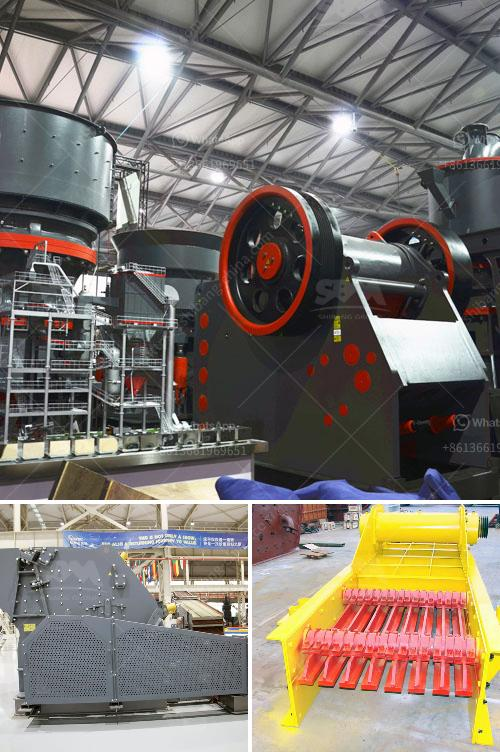

<h3>mobile stone crusher plant</h3>
Mobile stone crusher plant, for instance, is often used for mining and crushing hard stones into smaller sizes. In addition, this equipment can be utilized in various industries, including construction, metallurgy, chemical, and railway.

Mobile stone crusher plant consists of vibrating feeder, primary jaw crusher, secondary cone crusher, vibrating screen, and belt conveyor. All these machines are assembled on one mobile chassis, which greatly simplifies the plant installation and reduces the labor cost.

The mobile stone crusher plant is mainly used for metallurgy, chemical industry, building materials, hydropower and other materials that often need to be moved. Especially for the operation of crushed stone such as highways, railways, hydropower projects. The tyre crushing machine and tracked crusher are two types of portable crushing.

According to the needs of working, JXSC products mobile jaw crusher, impact crusher, cone crusher, and screen equipment. All model of JXSC mobile crushers

In the field of construction waste disposing, there also has a lot of mobile crushing equipment with good performance in China. But here we recommend SBM's k-series mobile crusher.

The K3 Series Portable Crushing Plant and K Wheel-type Mobile Crusher of SBM are all hot products in the market. Many well-known companies around the world came there to buy this product. As a super star in aggregates industry, K series mobile crushers are widely used in infrastructure and mining processing.

And they helped customers to solve difficulties in quarry and infrastructure construction. In 2017, they created the first manufacturer of intelligent sand making line in China .

What's more, SBM Mobile Crushing Plant uses fully-weighted super-long and super-wide tracks to improve safety and stability.

While ensuring efficiency and reducing wear, it also improves the equipment's operation rate and production capacity.

We have conducted a detailed market research and found that SBM's production technology and performance of the crushers have been significantly improved compared to conventional crushers. In addition, the mobile crushing plants are environmentally friendly because of their diesel noise and exhaust emissions, which are now more and more well received by customers when compared to similar equipment in the market.

Therefore, it is also suitable for quarrying environment protection, and urban construction waste disposal and other fields. SBM provides a variety of mobile crushers for sale in various countries of the world. Customers can get ideal products and satisfactory services from SBM.

If you are interested in our products or have any questions, please feel free to contact us. You can also leave your contact information and we will contact you ASAP.

In conclusion, mobile stone crusher plant is a useful equipment in the stone crusher production line. Its advantages are as follows: high stability, reliable operation, convenient maintenance and overhaul, and little production and construction cost.

As the main machinery in the process, the mobile stone crusher plant can produce up to 400 tons per hour with a high degree of automation, low cost, large crushing ratio, energy saving, high output, less pollution and easy maintenance. The size of the finished product is even and in good shape, which meets the national standards for high-speed materials.
<h3>Contact us</h3><ul><li><strong>Whatsapp:&nbsp;<a href="https://wa.me/8613661969651">+8613661969651</a></strong></li><li><a href="https://swt.shibang-china.com/?git&amp;zhl&amp;mobile stone crusher plant"><strong>Online Service(chat now)</strong></a></li></ul><h3>Related</h3><ul><li><a href='sand and gravel crusher.md'>sand and gravel crusher</a></li><li><a href='metal crusher for rent.md'>metal crusher for rent</a></li><li><a href='clay crusher processing in india.md'>clay crusher processing in india</a></li><li><a href='price of plant crusher in nigeria.md'>price of plant crusher in nigeria</a></li><li><a href='price of plants crushing.md'>price of plants crushing</a></li></ul>