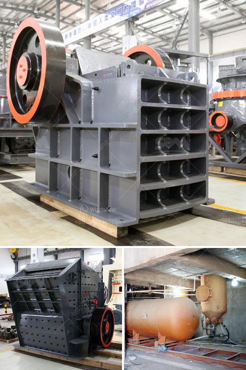

<h3>mobile stone crusher with vibrating screen</h3>
Mobile stone crusher is a machine that has been designed to crush rocks into various sizes for different applications such as construction purposes. The mobile crushing plant consists of crushers, vibrating screen, and feeder, hopper, and conveyor. With the capability to move around freely, the mobile stone crusher with vibrating screen can effectively process various types of materials such as limestone, granite, marble, basalt, iron ore, construction waste, etc.

One of the key features of this mobile stone crusher is its ability to cater to a wide range of applications. The vibrating screen is designed to separate crushed materials into different sizes, allowing for easier processing and utilization. By having multiple sizes available, materials can be used for various purposes, such as road construction, building foundations, or even as aggregate for concrete production.

Another advantage of the mobile stone crusher with vibrating screen is its adaptability. This machine can be used in different locations and environments, allowing for greater flexibility in operations. Whether it is a construction site, mining area, or quarry, the mobile stone crusher can easily be transported to different sites, ensuring efficient and reliable crushing operations.

In addition, the presence of the vibrating screen enhances the efficiency of the crushing process. The vibrating screen helps in the proper sorting of the crushed materials, ensuring that only the desired sizes are sent for further processing. This results in reduced wastage and improved productivity, as only the required material is processed, saving both time and resources.

Furthermore, the mobile stone crusher with vibrating screen is equipped with a powerful engine that provides high crushing capacity. This ensures that large quantities of materials can be processed efficiently, allowing for faster and more productive operations.

In conclusion, the mobile stone crusher with vibrating screen is a versatile and highly efficient machine that can be used in various industries. Its adaptability, mobility, and high capacity make it an ideal choice for crushing and screening applications. With its ability to process different materials and its easy transportation to different sites, this machine proves to be a valuable asset for any construction or mining project.
<h3>Contact us</h3><ul><li><strong>Whatsapp:&nbsp;<a href="https://wa.me/8613661969651">+8613661969651</a></strong></li><li><a href="https://swt.shibang-china.com/?git&amp;zhl&amp;mobile stone crusher with vibrating screen"><strong>Online Service(chat now)</strong></a></li></ul><h3>Related</h3><ul><li><a href='mobile crushing and screening manufacturer in india.md'>mobile crushing and screening manufacturer in india</a></li><li><a href='mobile rock crusher for sale.md'>mobile rock crusher for sale</a></li><li><a href='limestone powder making process.md'>limestone powder making process</a></li><li><a href='grinding of copper ores.md'>grinding of copper ores</a></li><li><a href='purchase a small rock stone crusher in philippines.md'>purchase a small rock stone crusher in philippines</a></li></ul>