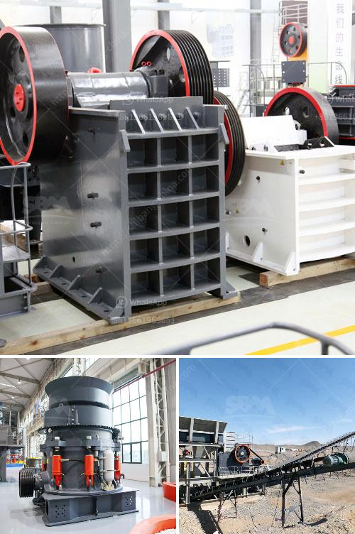

<h3>mobile stone crushers for sale south africa</h3>
Mobile stone crushers are a type of stone crusher that is suitable for crushing various types of stones. They are widely used in mining, construction, and other industries. They are normally mounted on crawler tracks, but can also be transported by truck. These machines come in various sizes, from small and compact to large and robust.

One of the key benefits of mobile stone crushers is their ability to move easily and flexibly, which allows the machine to crush materials on-site. This reduces the transportation cost and saves time for the construction projects. In addition, mobile crushers can also be used to recycle construction waste, which helps reduce waste disposal costs.

In South Africa, there are many stone crusher manufacturers, and with the development of mining industry, more and more investors choose to enter the stone crushing industry. There are many different types of stone crushers for sale in South Africa, such as jaw crushers, cone crushers, impact crushers, hammer crushers, mobile crushers and screens. The market conditions of mobile crushers in South Africa is broadly the same as other crusher industries in South Africa.

However, the productivity of mobile crusher is much higher than that of other crushers. According to the feedback from users in South Africa, the Mobile stone crushers with a daily output of 500 tons are mainly used for crushing and screening in road and bridge construction projects, stone mines, chemical plants, etc. and the cost investment is relatively high.

However, for mobile stone crushers with a daily output of 300-500 tons, the production cost is relatively low. The mobile stone crusher with a production capacity of 300-500 tons per hour can be equipped with vibrating screen and belt conveyor. Compared with the fixed stone crusher, the yield is higher, and the finished product is more uniform and refined, with fewer needle-like particles. In addition, the mobile stone crusher can be moved to different crushing sites to conduct on-site crushing operations, especially for construction waste disposal, which greatly reduces the transportation cost of materials.

Moreover, the South African government has increased investment in infrastructure construction in recent years, which has further stimulated the demand for mobile stone crushers. Many large projects require on-site crushing operations, and mobile stone crushers are the best choice for these projects.

In conclusion, mobile stone crushers have become an essential equipment in modern construction projects, and South Africa is no exception. The demand for mobile stone crushers for sale in South Africa is increasing, and these machines are welcomed by all over the world. On the other hand, the analysis mentioned above highlights the need for choosing high-quality mobile stone crushers, thus enhancing their durability and lifespan.
<h3>Contact us</h3><ul><li><strong>Whatsapp:&nbsp;<a href="https://wa.me/8613661969651">+8613661969651</a></strong></li><li><a href="https://swt.shibang-china.com/?git&amp;zhl&amp;mobile stone crushers for sale south africa"><strong>Online Service(chat now)</strong></a></li></ul><h3>Related</h3><ul><li><a href='small ball grinding machine.md'>small ball grinding machine</a></li><li><a href='quarry crusher machine equipment in germany prices.md'>quarry crusher machine equipment in germany prices</a></li><li><a href='used raymond mills barite raymond mill.md'>used raymond mills barite raymond mill</a></li><li><a href='china raymond mill company.md'>china raymond mill company</a></li><li><a href='alluvial diamond processing plant container for sale.md'>alluvial diamond processing plant container for sale</a></li></ul>