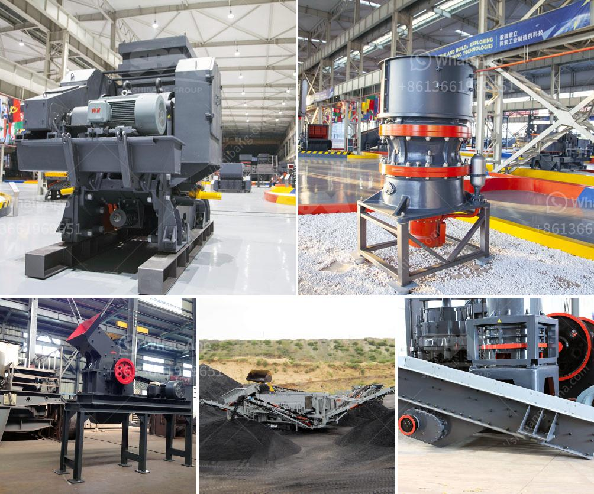

<h3>mobile stone crushers</h3>
Mobile stone crushers are a recent innovation in the mining and construction industry. These machines are specifically designed for reducing the size of stones and rocks for various purposes such as road construction, building construction, and aggregate production. Mobile stone crushers are also popular for their versatility as they can be used in various industries for different purposes.

One of the key advantages of mobile stone crushers is their ability to move from one location to another effortlessly. This mobility feature eliminates the need for transporting stones and rocks to the crushing site, thereby reducing transportation costs. Additionally, mobile stone crushers can be easily set up and dismantled, allowing for more flexibility in terms of project requirements. This is especially beneficial for construction projects that require crushing at multiple sites.

Another advantage of mobile stone crushers is their compact size, making them easily transportable. These crushers can be loaded onto trailers or other large vehicles, allowing for easier transportation to remote construction sites. Compact size also means that mobile stone crushers can be maneuvered into tight spaces, thereby increasing their usability in areas where larger crushing machines cannot reach.

The portability and compactness of mobile stone crushers are further enhanced by their self-propelled nature. These crushers are typically equipped with powerful engines that enable them to move around effortlessly. Self-propelled mobile stone crushers offer the convenience of not having to rely on external power sources, making them suitable for use in remote areas where electricity may not be readily available.

Mobile stone crushers come in different sizes and capacities, ranging from 30 to 500 tons per hour. Some popular models include 50 tph, 100 tph, 200 tph, and 300 tph crushers. Mobile stone crushers are suitable for stone an ore crushing process,  including construction materials, river pebbles, granite, basalt, limestone, quartzite, and iron ore. Depending on the application, mobile stone crushers can produce different sizes of aggregates for various construction projects.

In conclusion, mobile stone crushers have revolutionized the mining and construction industry by providing convenience, cost-effectiveness, and versatility. Their ability to move from one location to another, compact size, self-propelled nature, and wide range of applications have made them a popular choice for crushing operations. Whether it's road construction, building construction, or aggregate production, mobile stone crushers offer efficient and flexible solutions. With continuous advancements in technology, it can be expected that mobile stone crushers will become even more efficient and user-friendly in the future.
<h3>Contact us</h3><ul><li><strong>Whatsapp:&nbsp;<a href="https://wa.me/8613661969651">+8613661969651</a></strong></li><li><a href="https://swt.shibang-china.com/?git&amp;zhl&amp;mobile stone crushers"><strong>Online Service(chat now)</strong></a></li></ul><h3>Related</h3><ul><li><a href='used stone crushers for sale south africa.md'>used stone crushers for sale south africa</a></li><li><a href='sand washing machine price.md'>sand washing machine price</a></li><li><a href='grinding roller mills manufacturer from china.md'>grinding roller mills manufacturer from china</a></li><li><a href='china quarry crusher equipment.md'>china quarry crusher equipment</a></li><li><a href='used construction machinery rates in pakistan.md'>used construction machinery rates in pakistan</a></li></ul>