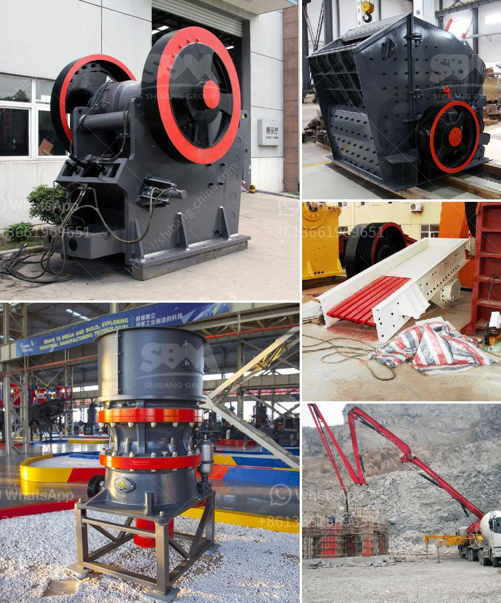

<h3>mobile vibrating screens for hire in south africa</h3>
Mobile vibrating screens are versatile pieces of equipment that offer a cost-effective way to enhance screening efficiency. These screens are ideal for use in various industries such as mining, quarrying, recycling, construction, and demolition. In South Africa, there is a growing trend of hiring these machines from reputable companies that offer mobile vibrating screens for hire.

One of the key advantages of using mobile vibrating screens is their flexibility. They can be easily transported to different job sites, allowing for efficient screening of materials wherever they are needed. These screens are often mounted on tracks, making them highly maneuverable and capable of working in even the most challenging environments.

Another benefit of hiring mobile vibrating screens is the ability to choose the right equipment for specific screening requirements. Different screens are designed to handle various types of materials and sizes. For instance, some screens are better suited for processing sand and gravel, while others are more efficient at handling larger rocks or bulkier materials. By renting the appropriate equipment, businesses can ensure optimal screening results.

The mobile vibrating screens available for hire in South Africa are designed to screen a wide variety of materials including aggregates, compost, topsoil, coal, construction, and demolition waste, mine ore, sand, gravel, and more. This versatility is ideal for numerous industry sectors that are focused either on processing raw materials or separating them into finished products.

Mobile vibrating screen rentals in South Africa are an affordable and convenient option for businesses, enabling them to eliminate the costs associated with owning and maintaining their own equipment. These screens are equipped with state-of-the-art technology, ensuring reliable and efficient screening processes. Renting also gives companies the flexibility to scale their operations based on project requirements without significant financial commitments.

Additionally, hiring mobile vibrating screens allows businesses to take advantage of expert advice and technical support provided by reputable service providers. These companies have experienced personnel who can assist in selecting the right equipment, setting up the screens, and providing ongoing maintenance and repairs. This ensures that businesses can maximize the benefits of using the equipment and minimize any downtime due to technical issues.

In conclusion, mobile vibrating screens for hire in South Africa offer numerous benefits to businesses in various industries. With their flexibility, versatility, and cost-effectiveness, these screens provide an excellent solution for companies that require efficient screening of materials. By renting this equipment, businesses can eliminate the costs associated with ownership, access the latest technology, and benefit from expert technical support. Whether it is for a short-term project or long-term operations, mobile vibrating screen rentals offer a practical and efficient screening solution.
<h3>Contact us</h3><ul><li><strong>Whatsapp:&nbsp;<a href="https://wa.me/8613661969651">+8613661969651</a></strong></li><li><a href="https://swt.shibang-china.com/?git&amp;zhl&amp;mobile vibrating screens for hire in south africa"><strong>Online Service(chat now)</strong></a></li></ul><h3>Related</h3><ul><li><a href='portable coal cone crusher for hire angola.md'>portable coal cone crusher for hire angola</a></li><li><a href='sand and gravel crusher.md'>sand and gravel crusher</a></li><li><a href='used portable roller crushers and screens.md'>used portable roller crushers and screens</a></li><li><a href='crushing equipment for rent.md'>crushing equipment for rent</a></li><li><a href='standard operating procedure for coal pulverizer.md'>standard operating procedure for coal pulverizer</a></li></ul>