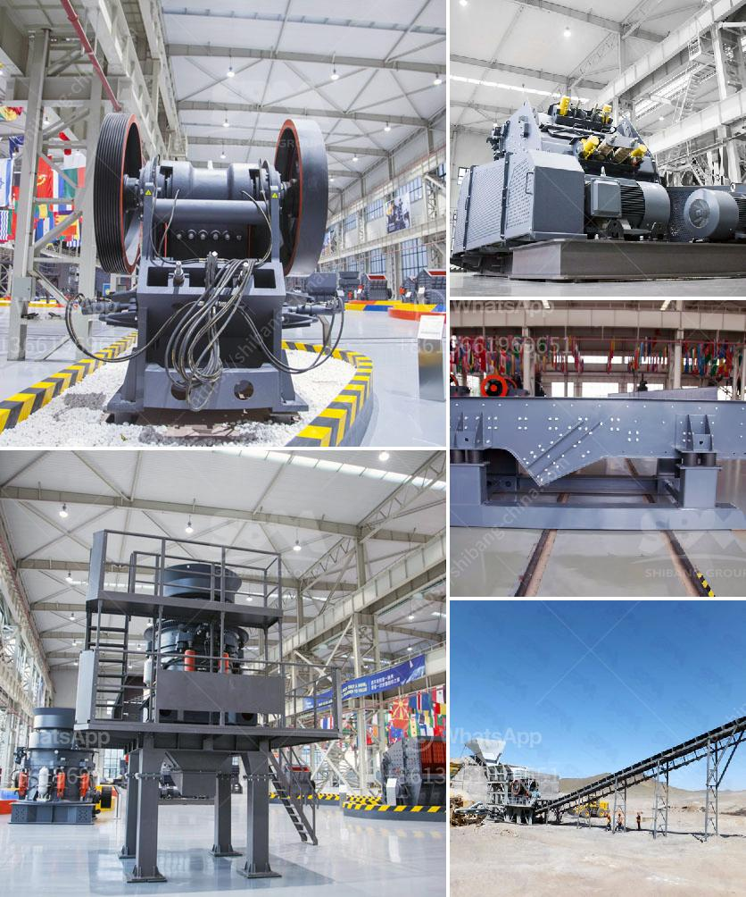

<h3>models and prices of vibrating screens</h3>
A vibrating screen is a mechanical tool used to separate solids, liquids, and powders. It is widely utilized in various industries such as mining, metallurgy, coal, chemical, and construction. With the advancement in technology, vibrating screens have become more efficient and have a wide range of applications. In this article, we will discuss the different models and prices of vibrating screens available in the market.

When it comes to vibrating screens, there are several factors to consider before making a purchase. These factors include the size of the screen, the type of material being processed, the desired output, and the budget.

One of the most common types of vibrating screens is the inclined screen. It consists of a circular motion vibrating mechanism, a deck made of steel wire mesh or perforated metal plate, and a drive unit. Inclined screens are suitable for processing large quantities of material and are known for their high screening capacity. The price range for inclined vibrating screens varies depending on the size and capacity, ranging from $5,000 to $30,000.

Another popular type is the horizontal screen, which is more suitable for smaller material sizes. It operates on a linear motion principle and is less inclined than the inclined screen. Horizontal screens are commonly used for fine screening applications and can be found in industries such as sand and gravel, minerals, and ore processing. The price range for horizontal vibrating screens can range from $10,000 to $50,000, depending on the size and capacity.

In addition to the inclined and horizontal screens, there are specialized vibrating screens designed for specific applications. For example, banana screens have a curved deck that increases the screening efficiency. These screens are commonly used in coal processing plants and have a higher price range, starting from $30,000 and going up to $100,000.

Besides the type of screen, there are also different sizes available. The size of the vibrating screen is measured in terms of the width and length of the deck. Smaller screens, typically used in laboratory or pilot plant applications, can cost around $2,000 to $5,000. Medium-sized screens, suitable for small to medium-sized operations, can range from $5,000 to $15,000. Larger screens, commonly used in industrial-scale operations, can cost anywhere from $15,000 to $100,000, depending on the specifications and features.

It is essential for buyers to consider the price in relation to the quality and performance of the vibrating screen. Cheap screens may save costs initially, but they might have a shorter lifespan and require frequent maintenance. On the other hand, high-end screens with advanced features and superior durability might come at a higher price but can provide better long-term value.

In conclusion, vibrating screens are essential equipment in various industries, and there are several models and prices available to suit different needs and budgets. It is crucial for buyers to understand their requirements and consider factors such as type, size, capacity, and quality before making a purchase decision. By investing in a reliable vibrating screen, businesses can enhance their production efficiency and achieve better results in their operations.
<h3>Contact us</h3><ul><li><strong>Whatsapp:&nbsp;<a href="https://wa.me/8613661969651">+8613661969651</a></strong></li><li><a href="https://swt.shibang-china.com/?git&amp;zhl&amp;models and prices of vibrating screens"><strong>Online Service(chat now)</strong></a></li></ul><h3>Related</h3><ul><li><a href='mobile crusher line.md'>mobile crusher line</a></li><li><a href='raymond bowl coal mill drawings.md'>raymond bowl coal mill drawings</a></li><li><a href='coal mining machines in india.md'>coal mining machines in india</a></li><li><a href='gold refinery equipment china.md'>gold refinery equipment china</a></li><li><a href='aggregates for concrete crusher in nigeria.md'>aggregates for concrete crusher in nigeria</a></li></ul>