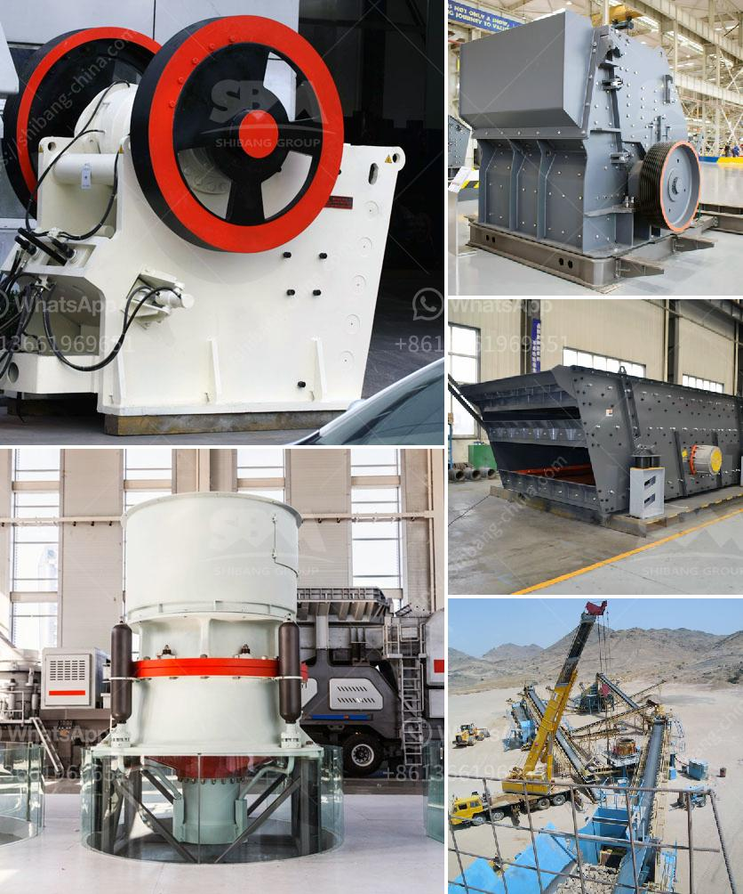

<h3>models of ball mills</h3>
Ball mills are widely used in the grinding process of cement, metal and non-metal ores, chemical minerals, building materials and other materials. Some models of ball mills have different capacities, so below are some models of ball mills with different capacities.

The 600×700mm ball mill is a small-scale grinding equipment that can grind materials into 0.075-0.89mm. It has a small capacity of 0.65-2t/h, which is suitable for small-scale production. This type of ball mill is equipped with a cylindrical shell made of steel and lined with lining plates. The steel balls inside the shell grind the material, and the material is discharged from the discharge port at the end of the shell after being ground into a fine powder.

The 900×1800mm ball mill has a larger capacity than the 600×700mm ball mill. It can grind materials into a finer powder with a particle size of 0.075-0.89mm. The ball mill is equipped with a hollow cylindrical shell that has a lining plate made of wear-resistant material. The material is fed into the shell through the feeding device and is ground by the steel balls inside the shell. The ground material is discharged from the discharge port at the other end of the shell.

The 2200×6500mm ball mill is a large-scale grinding equipment with a production capacity of 14-35t/h. It has a higher processing capacity and lower energy consumption compared to the smaller models. This type of ball mill is widely used in cement plants, mining plants, and ore beneficiation plants. The material is fed into the mill through the feeding device and is ground by the steel balls inside the mill. The ground material is discharged from the discharge port.

In conclusion, ball mills are essential grinding equipment in various industries. Different models of ball mills are suitable for different production capacities. The size of the ball mill determines the amount of material that can be ground and the fineness of the final product. When choosing a ball mill, it is crucial to consider the production requirements and the characteristics of the material being ground to ensure the best grinding performance.
<h3>Contact us</h3><ul><li><strong>Whatsapp:&nbsp;<a href="https://wa.me/8613661969651">+8613661969651</a></strong></li><li><a href="https://swt.shibang-china.com/?git&amp;zhl&amp;models of ball mills"><strong>Online Service(chat now)</strong></a></li></ul><h3>Related</h3><ul><li><a href='price of zenith crusher.md'>price of zenith crusher</a></li><li><a href='crusher for cobble.md'>crusher for cobble</a></li><li><a href='cement grinding ball mill process.md'>cement grinding ball mill process</a></li><li><a href='iron crushing plant in mexico.md'>iron crushing plant in mexico</a></li><li><a href='ball mill balls suppliers.md'>ball mill balls suppliers</a></li></ul>