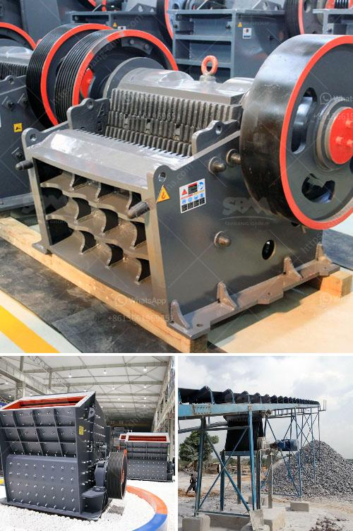

<h3>mtm raymond mill</h3>
Grinding mills are indispensable equipment in many industries, such as mining, cement, metallurgy, chemical, and more. Among them, Raymond Mill is an exceptional ore grinding equipment with outstanding performance, broad application range, and remarkable productivity.

One of the most popular models of Raymond Mill is MTM, which stands for Medium-speed Trpezium Mill. This innovative mill features advanced grinding technology and remarkable structural design. Its excellent performance has made it widely used in the market.

The MTM Raymond Mill boasts several key features that set it apart from other grinding mills. Firstly, it adopts a multi-stage grinding process, which significantly improves the grinding efficiency. This unique design ensures that the finished product has a uniform particle size, enhancing its quality and market value.

Secondly, the MTM Raymond Mill has a high grinding pressure and a stable grinding ring device. This makes the mill more efficient, with a higher output and lower energy consumption. It can produce large amounts of fine powder, making it the preferred choice for customers seeking high-quality and high-yield grinding equipment.

Moreover, the advanced dust removal system equipped in the MTM Raymond Mill ensures a clean and healthy working environment. The dust removal efficiency is up to 99.9%, effectively preventing pollution caused by dust particles and protecting the health of operators.

Additionally, the MTM Raymond Mill features a humanized design with convenient maintenance and operation. The mill adopts a centralized oil lubrication system, which greatly reduces maintenance and repair costs. It also has an automatic control system that allows for easy operation and regulation.

In conclusion, the MTM Raymond Mill is a powerful and efficient grinding equipment that brings numerous benefits to various industries. Its advanced technology, stable performance, and excellent grinding efficiency make it an excellent choice for those in need of reliable and high-quality grinding mills. With its exceptional features and outstanding productivity, the MTM Raymond Mill is truly a game-changer in the world of ore grinding.
<h3>Contact us</h3><ul><li><strong>Whatsapp:&nbsp;<a href="https://wa.me/8613661969651">+8613661969651</a></strong></li><li><a href="https://swt.shibang-china.com/?git&amp;zhl&amp;mtm raymond mill"><strong>Online Service(chat now)</strong></a></li></ul><h3>Related</h3><ul><li><a href='clay crusher processing in india.md'>clay crusher processing in india</a></li><li><a href='quarry machinery manufacturers.md'>quarry machinery manufacturers</a></li><li><a href='grinding ball mill price.md'>grinding ball mill price</a></li><li><a href='vertical mills retention time formula.md'>vertical mills retention time formula</a></li><li><a href='portable sand washing machine.md'>portable sand washing machine</a></li></ul>