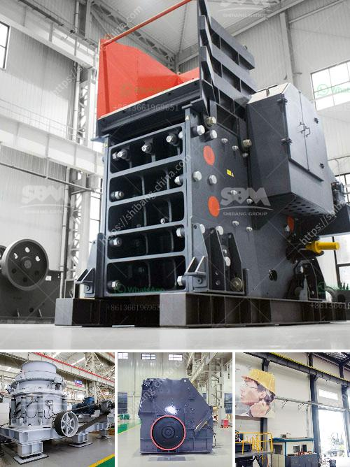

<h3>mtw european type trapezium mill</h3>
The MTW European type trapezium mill is a popular product in the market due to its unique features and advantages. It sets the bar high for the competition with its outstanding performance, superior quality, and advanced technology. In this article, we will take a closer look at this mill and explore why it is a preferred choice among customers.

First and foremost, the MTW European type trapezium mill is known for its high efficiency. It adopts the bevel gear integral transmission, which ensures a smooth and reliable operation. The traditional mill generally uses the conical gear, which is inefficient and prone to wear and tear. By incorporating the bevel gear integral transmission, the MTW mill effectively reduces power loss, enhances transmission efficiency, and extends the service life of the machine.

Moreover, this mill is equipped with a unique grinding roller assembly. The assembly is connected via a curved bevel gear, which not only improves the stability and structural strength but also enables more accurate transmission of power. This design reduces the vibration and noise during operation, creating a more comfortable working environment.

Another remarkable feature of the MTW European type trapezium mill is its advanced technology. It adopts a number of patented technologies, such as trapezoidal elastic connection, which effectively avoids the problems of excessive wear and tear on the gear and prolongs the service life of the equipment.

In addition, the mill is designed with a curved-typed trapezoidal grinding roller. This unique design greatly improves the grinding efficiency, reduces energy consumption, and ensures the uniformity of the finished product. The adjustable frequency control system further enhances the precision of the final product size, meeting different requirements of customers.

Furthermore, the MTW European type trapezium mill is easy to operate and maintain. It has a user-friendly design, making it convenient for operators to adjust the parameters and control the production process. Additionally, the surface of the mill is treated with a special wear-resistant material, preventing corrosion and reducing the frequency and intensity of maintenance.

In conclusion, the MTW European type trapezium mill is a top-notch product in the market. Its efficient performance, advanced technology, and easy operation make it a preferred choice among customers. Furthermore, its reliability and durability ensure a long-lasting and cost-effective investment for businesses. Whether it is used in mining, construction, or other industries, this mill delivers exceptional results every time.
<h3>Contact us</h3><ul><li><strong>Whatsapp:&nbsp;<a href="https://wa.me/8613661969651">+8613661969651</a></strong></li><li><a href="https://swt.shibang-china.com/?git&amp;zhl&amp;mtw european type trapezium mill"><strong>Online Service(chat now)</strong></a></li></ul><h3>Related</h3><ul><li><a href='silica sand washing purification.md'>silica sand washing purification</a></li><li><a href='cobalt ore mining processing plant.md'>cobalt ore mining processing plant</a></li><li><a href='iron ore vibrator screen.md'>iron ore vibrator screen</a></li><li><a href='sand screening mobile washing plants for sale.md'>sand screening mobile washing plants for sale</a></li><li><a href='200tph stationary crushing plant.md'>200tph stationary crushing plant</a></li></ul>