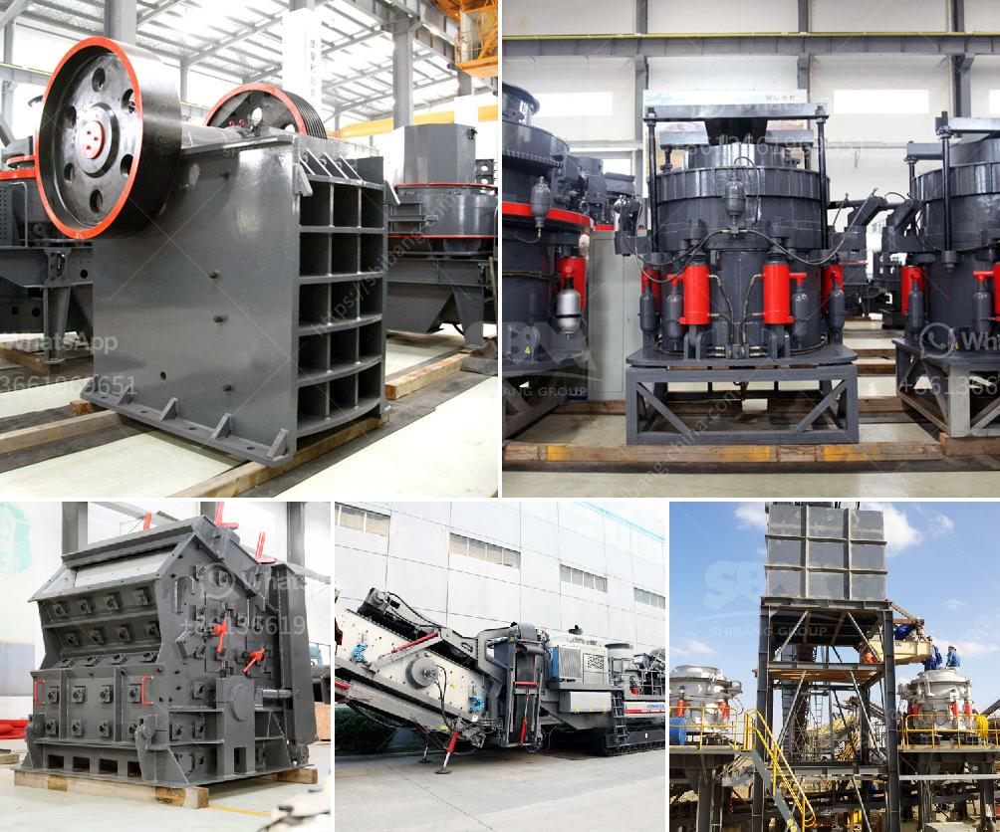

<h3>mtw trapezium mill</h3>
The MTW trapezium mill is a popular milling machine for grinding minerals into powder, specifically for producing fine powders like calcium carbonate, gypsum, limestone, talc, and kaolin. This mill is widely used in many industrial fields, such as metallurgy, mining, chemical engineering, cement, construction, refractory materials, and ceramics.

One of the key features of the MTW trapezium mill is its efficient grinding capability. It employs a unique roller and grinding ring design, which greatly improves the grinding efficiency and reduces energy consumption. The roller and grinding ring are made from high-quality materials, ensuring durability and long service life.

Another advantage of the MTW trapezium mill is its adjustable fineness. With the help of a high-density impeller and precision analysis machine, the mill can achieve accurate and arbitrary adjustment of the finished product fineness. This makes it possible to produce powders of different particle sizes to cater to various industrial needs.

Additionally, the MTW trapezium mill is equipped with an advanced dust removal system, which effectively reduces dust pollution and protects the environment. It also has a high degree of automation, making it easy to operate and maintain.

Overall, the MTW trapezium mill is an excellent choice for grinding minerals into fine powders. Its efficient grinding capability, adjustable fineness, and advanced features make it suitable for a wide range of applications in various industries. Whether you're in the mining, construction, or chemical engineering industry, the MTW trapezium mill can deliver exceptional performance and ensure excellent product quality.
<h3>Contact us</h3><ul><li><strong>Whatsapp:&nbsp;<a href="https://wa.me/8613661969651">+8613661969651</a></strong></li><li><a href="https://swt.shibang-china.com/?git&amp;zhl&amp;mtw trapezium mill"><strong>Online Service(chat now)</strong></a></li></ul><h3>Related</h3><ul><li><a href='how to design stone crusher building.md'>how to design stone crusher building</a></li><li><a href='micro powder mill cost.md'>micro powder mill cost</a></li><li><a href='vibrating feeder vs belt conveyor.md'>vibrating feeder vs belt conveyor</a></li><li><a href='mining machinery manufacturer in italy.md'>mining machinery manufacturer in italy</a></li><li><a href='crusher jaw crusher 6x8 jaw.md'>crusher jaw crusher 6x8 jaw</a></li></ul>