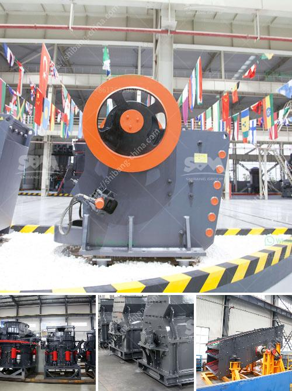

<h3>multi vibrating screen pdf</h3>
Multi-vibrating screens, also known as multi-deck vibrating screens, are innovative screening solutions designed to improve efficiency and productivity in various industries. This technology utilizes multiple screens stacked on top of each other to provide more screen area within a smaller footprint. In this article, we will delve into the benefits and applications of multi-vibrating screens, emphasizing their role in enhancing separation and screening processes.

One of the significant advantages of multi-vibrating screens is their ability to provide a larger screening area compared to single-deck screens. With multiple decks vertically layered on top of each other, these screens offer more opportunities for material separation. The increased screening area allows for enhanced particle separation, enabling finer materials to be screened efficiently. This aspect is particularly beneficial in industries such as mining, aggregate processing, and recycling, where high-quality separation and classification are critical.

Combining multiple decks in a single screening machine significantly improves efficiency and accuracy. Each deck can be independently adjusted, allowing customizable separation based on particle size. By segregating materials into specific size ranges, multi-vibrating screens ensure accurate screening and reduce the chances of undersized or oversized particles passing through. Furthermore, the ability to fine-tune and optimize each deck's motion and frequency enhances the precision of separation, resulting in a higher-quality end product and reduced waste.

Multi-vibrating screens offer tremendous versatility and adaptability to various applications. The decks can be easily configured to accommodate different requirements, such as scalping, sizing, or dewatering. The screens are also available in different sizes and types, allowing for customization according to specific processing needs. This flexibility enables the efficient and cost-effective screening of a wide range of materials, including aggregates, ores, crushed stone, and waste materials.

Another advantage of multi-vibrating screens is their compact design, often requiring less installation space compared to multiple single-deck screens. Additionally, the modular nature of these screens simplifies maintenance and replacement of individual decks. This leads to reduced downtime during maintenance or deck replacement, ensuring uninterrupted productivity. By minimizing downtime and enhancing maintenance procedures, overall operational efficiency is increased, resulting in significant cost savings in the long run.

Multi-vibrating screens are a valuable tool for industries that demand efficient separation and screening processes. Their versatility, efficiency, and enhanced productivity make them an excellent choice for various applications.
<h3>Contact us</h3><ul><li><strong>Whatsapp:&nbsp;<a href="https://wa.me/8613661969651">+8613661969651</a></strong></li><li><a href="https://swt.shibang-china.com/?git&amp;zhl&amp;multi vibrating screen pdf"><strong>Online Service(chat now)</strong></a></li></ul><h3>Related</h3><ul><li><a href='rock crushing companies.md'>rock crushing companies</a></li><li><a href='price conveyor belt price.md'>price conveyor belt price</a></li><li><a href='mobile aggregates washing plant.md'>mobile aggregates washing plant</a></li><li><a href='magnesite processing plant.md'>magnesite processing plant</a></li><li><a href='jual stone crusher mobile cap 30 tph in indonesia.md'>jual stone crusher mobile cap 30 tph in indonesia</a></li></ul>