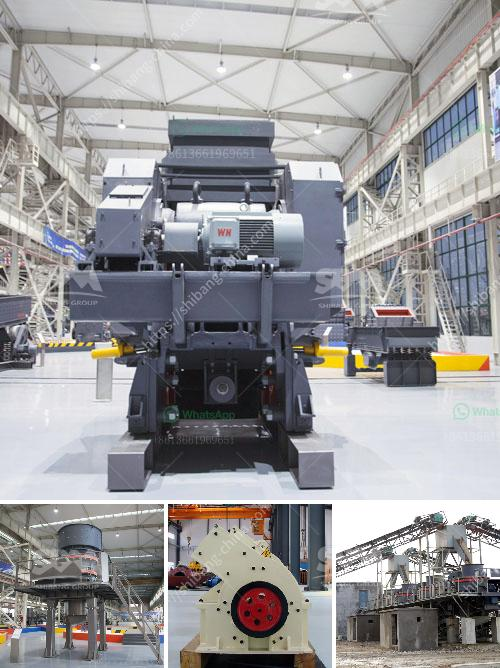

<h3>nickel slag grinding project in turkey</h3>
Nickel slag, a by-product of the nickel-refining process, is widely used as an additive material in the cement industry. It provides various advantages such as high strength, durability, and environmental sustainability. In Turkey, a nickel slag grinding project has recently been implemented to improve the utilization of nickel slag and increase cement production.

Turkey is a major producer of nickel ores and concentrates, with significant nickel refining activities. The country also has a thriving cement industry, with several plants spread across its provinces. The nickel slag grinding project aims to utilize nickel slag generated from nickel refining activities and to produce cement.

The project is a joint effort between a Turkish cement company and a major international engineering firm. The engineering firm specializes in providing solutions for the cement industry and has extensive experience in grinding projects. The Turkish cement company, on the other hand, has a strong presence in the local market and is known for its commitment to sustainable practices.

The grinding project involves the construction of a grinding plant in a designated area near the cement plant. The plant will be equipped with modern grinding machinery and will have the capacity to produce a significant amount of cement. The nickel slag will be transported from the nickel refining facility to the grinding plant and will be processed to obtain the desired particle size.

One of the key objectives of the project is to increase the utilization of nickel slag. Currently, a significant portion of the nickel slag produced in Turkey is either disposed of in landfills or used as road construction material. By utilizing nickel slag in the cement industry, the project aims to reduce the environmental impact of nickel refining activities and promote sustainable practices.

The use of nickel slag in cement production offers several advantages. Firstly, it improves the strength and durability of cement, resulting in better quality products. Secondly, it reduces the need for clinker, a primary ingredient in cement production that is energy-intensive and emits greenhouse gases. By replacing some of the clinker with nickel slag, the project helps to lower carbon dioxide emissions and reduces the environmental footprint of cement production.

Furthermore, the project is expected to have positive economic impacts. It will create job opportunities in both the construction and operation phases. Moreover, it will enhance the competitiveness of the Turkish cement industry by reducing production costs and increasing the production capacity.

Overall, the nickel slag grinding project in Turkey is a significant step towards sustainable cement production. By utilizing nickel slag and reducing the need for clinker, the project promotes environmental sustainability and helps to mitigate climate change. The project also supports local economic development and demonstrates the commitment of the Turkish cement industry to sustainable practices. It serves as a valuable example for other countries and industries that seek to enhance resource efficiency and reduce environmental impacts.
<h3>Contact us</h3><ul><li><strong>Whatsapp:&nbsp;<a href="https://wa.me/8613661969651">+8613661969651</a></strong></li><li><a href="https://swt.shibang-china.com/?git&amp;zhl&amp;nickel slag grinding project in turkey"><strong>Online Service(chat now)</strong></a></li></ul><h3>Related</h3><ul><li><a href='stone jaw crushers in japan.md'>stone jaw crushers in japan</a></li><li><a href='coal grinding mill.md'>coal grinding mill</a></li><li><a href='pe series jaw crusher and ton per day.md'>pe series jaw crusher and ton per day</a></li><li><a href='iron ore crushing and screening.md'>iron ore crushing and screening</a></li><li><a href='used sand screening plant for sale in uae.md'>used sand screening plant for sale in uae</a></li></ul>