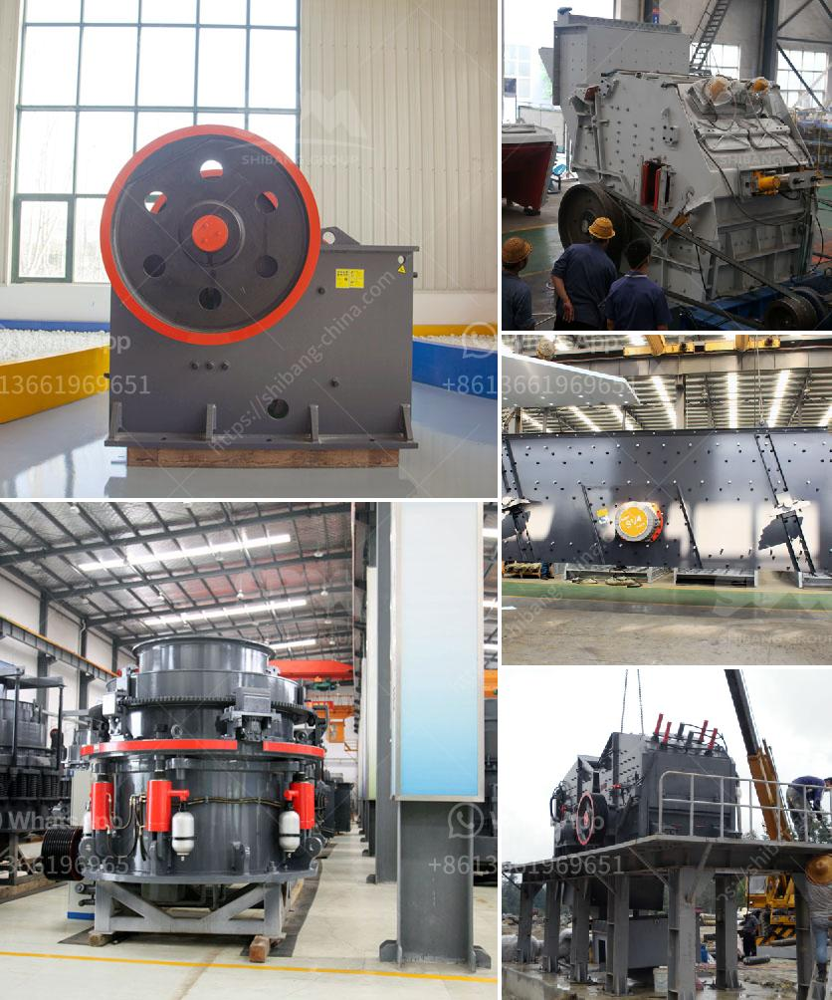

<h3>nigeria cone crusher photos</h3>
Nigeria, located in West Africa, is a country blessed with a diverse range of natural resources and a booming construction industry. Over the years, construction projects in Nigeria have witnessed tremendous growth, leading to an increased demand for modern machinery and equipment.

One such modern marvel in the construction industry is the cone crusher, a valuable piece of machinery that utilizes compression to crush materials efficiently. Cone crushers are widely used in various industries, including mining, aggregate, and construction, providing an essential solution for crushing materials into smaller particles.

The cone crusher operates by rotating the mantle, a concave-shaped material that sits on a vertical shaft, against a fixed, outer concave. This process compresses the materials, eventually breaking them down into smaller pieces. The crushed materials can then be used for various construction purposes, such as road construction, building foundations, and even concrete production.

In recent years, Nigeria has witnessed a significant increase in the usage of cone crushers in its construction projects. To showcase the advancements in the country's construction machinery, numerous photos have emerged, capturing these powerful machines in action. These photos highlight the state-of-the-art designs and advanced technology incorporated in the cone crushers, such as hydraulic systems for easy adjustment and overload protection.

Moreover, the photos also reveal the durability and reliability of these machines, particularly in harsh operating conditions. With a robust construction and high-quality materials, cone crushers in Nigeria can withstand the demanding requirements of the construction industry, ensuring longer service life and minimal downtime.

Additionally, the photos showcase the versatility of cone crushers. These machines can handle a wide range of materials, from limestone to granite, making them suitable for various construction projects across Nigeria. Whether it is a small-scale development or a large infrastructure project, the cone crusher offers a reliable and efficient solution for processing construction materials.

In conclusion, the cone crusher photos captured in Nigeria reflect the technological advancements in the construction machinery industry. These machines have become indispensable in the country's construction projects, providing efficient and reliable solutions for crushing materials. As Nigeria continues to witness rapid growth in construction, the cone crusher proves to be an essential tool for meeting the industry's demands and ensuring the successful completion of various projects across the nation.
<h3>Contact us</h3><ul><li><strong>Whatsapp:&nbsp;<a href="https://wa.me/8613661969651">+8613661969651</a></strong></li><li><a href="https://swt.shibang-china.com/?git&amp;zhl&amp;nigeria cone crusher photos"><strong>Online Service(chat now)</strong></a></li></ul><h3>Related</h3><ul><li><a href='stone cutting machine in india.md'>stone cutting machine in india</a></li><li><a href='hydraulic css control for jaw crusher.md'>hydraulic css control for jaw crusher</a></li><li><a href='concrete mobile crusher for rent in usa.md'>concrete mobile crusher for rent in usa</a></li><li><a href='tertiary impact crushers for quartz.md'>tertiary impact crushers for quartz</a></li><li><a href='price 200 crusher price.md'>price 200 crusher price</a></li></ul>