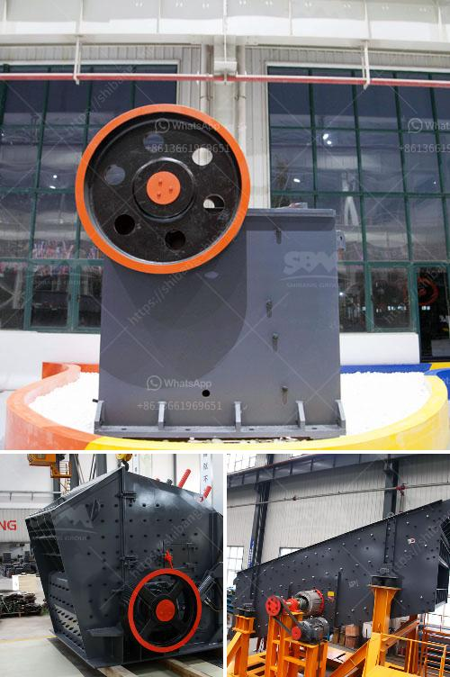

<h3>nigeria rock crusher for sale</h3>
Nigeria rock crusher for sale is the crushing plant that can deal with rock and stone materials such as limestone, quartz, marble, granite, basalt, diabase, etc. It is widely used in various fields, such as cement, sand, mining, construction, water conservancy, metallurgy, high ways and other fields. In Nigeria, rock crushers are used for crushing quarry rocks, stones, etc.

Usually, there are several stages involved, such as blasting, excavation, crushing, and grinding. In order to reduce the size of the rocks and make them suitable for the next stage, the rock crusher is necessary.

The Nigeria rock crusher is designed to crush medium hard rock with a compression strength of up to 300 Mpa and is suitable for quarry rock, limestone, basalt, marble, granite, etc. It is mainly used as primary crushing machine, but also can be used as secondary crushing machine when the rocks are crushed into smaller sizes.

A rock crusher for sale in Nigeria can handle materials with a side length of 100-500 mm or less, and its compressive strength can reach 350 MPa, which has the advantages of large crushing ratio, high yield, uniform product size, simple structure, reliable operation, easy maintenance, and low operating costs.

The rock crusher for sale in Nigeria is mainly composed of frame, rock crusher transmission shaft, eccentric sleeve, spherical bearing, crushing cone, adjusting device, adjusting sleeve, spring and hydraulic station for adjusting the discharge port.

The working principle of the Nigeria rock crusher is the motor drives the belt and the pulley, and moves the movable jaw up and down through the eccentric shaft. When the movable jaw rises, the angle between the toggle plate and the movable jaw becomes larger, thereby pushing the movable jaw plate closer to the fixed jaw plate, and the material is crushed or split. When the movable jaw moves downward, the angle between the toggle plate and the movable jaw becomes smaller, and the movable jaw leaves the fixed jaw under the action of the pull rod and spring, and the crushed material is discharged from the lower discharge port of the crushing chamber. With the continuous rotation of the motor, the crushing motor is periodically crushed and discharged to achieve mass production.

In addition, the Nigeria rock crusher also has many other advantages, such as excellent performance, high working efficiency, easy operation and maintenance, low running cost, high crushing ratio, uniform particle size, reliable operation, and environmental protection. It can be used for various mining and construction projects, providing customers with high-quality crushed stone aggregates.

In conclusion, the Nigeria rock crusher for sale is a versatile and cost-effective option for crushing and grinding rocks and stones, providing customers with high-quality crushed stone aggregates. It can be used for various applications, such as construction, mining, quarrying, and recycling, fulfilling all your crushing needs. Whether you are a quarry owner, construction company, or contractor, the Nigeria rock crusher is your best choice.
<h3>Contact us</h3><ul><li><strong>Whatsapp:&nbsp;<a href="https://wa.me/8613661969651">+8613661969651</a></strong></li><li><a href="https://swt.shibang-china.com/?git&amp;zhl&amp;nigeria rock crusher for sale"><strong>Online Service(chat now)</strong></a></li></ul><h3>Related</h3><ul><li><a href='enquiry about impact crusher.md'>enquiry about impact crusher</a></li><li><a href='silica sand plant supplier in malaysia.md'>silica sand plant supplier in malaysia</a></li><li><a href='hammer crusher price one ton per hour.md'>hammer crusher price one ton per hour</a></li><li><a href='cost for starting a granite manufacturing.md'>cost for starting a granite manufacturing</a></li><li><a href='conveyor belts for dies.md'>conveyor belts for dies</a></li></ul>