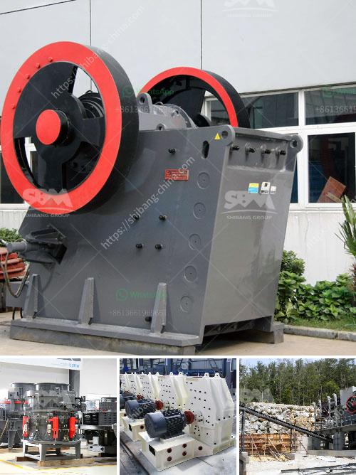

<h3>nigeria rock crushing plant</h3>
Rock crushing plant is a facility that is installed in the vicinity of almost all major cities and towns in Nigeria. The facility crushes rocks into smaller sizes, which can be used as construction materials. There are various types of rock crushing plants that are used in different sectors of the country, including in the mining industry.

The rock crushing plant is an important equipment used in mining industry. It is used as a secondary crusher to crush hard and abrasive materials. In Nigeria, limestone is widely used in the construction industry, road construction, and various building projects. As a natural stone resource, Nigerian farmers often use limestone in improving their soil condition. The limestone is also used to make cement.

Nigeria has a great demand for rock crushing plants. This is due to the fact that there are lots of mineral deposits in Nigeria including coal, gold, iron ore, limestone, columbite, and lead-zinc. In the mining industry, many crushers are utilized to crush these minerals into smaller pieces for further processing. Various crushers such as jaw crushers, impact crushers, and cone crushers are used in this process.

One important aspect of the rock crushing plant is its energy consumption. Low energy consumption is an essential feature of the mining industry in Nigeria. Large and expensive machines require a significant amount of energy to operate. This is why equipment that consumes less energy is preferred. The rock crushing plant in Nigeria consumes less energy compared to other types of crushers.

Rock crushing plants are cost-effective due to low operational costs rather than expensive heavy-duty crushers. 'Rock Crushing Plant' which is the free market solution for Nigeria's mining sector will also help to shape competition within the industry. On a more positive note, one of the breakthroughs with the rock crushing plant is the alternative to the conventional type of construction equipment used in Nigeria.

With the rock crushing plant, operators are now seeing opportunities to improve their revenue and profitability. They can reduce downtime, increase efficiency, and lower production costs by investing in this machinery. The rock crushing plant is efficient as it crushes large quantities of hard and abrasive materials without any problems. It can handle a wide range of materials, making it suitable for various applications in the mining industry.

In conclusion, Nigeria rock crushing plant is a vital equipment in mining industry. It helps in improving efficiency, reducing downtime, and lowering production costs. The rock crushing plant is cost-effective and energy efficient. It efficiently crushes materials, making it suitable for a wide range of applications in different sectors of the mining industry. With its numerous advantages, the rock crushing plant is an essential machinery for Nigeria's mining sector.
<h3>Contact us</h3><ul><li><strong>Whatsapp:&nbsp;<a href="https://wa.me/8613661969651">+8613661969651</a></strong></li><li><a href="https://swt.shibang-china.com/?git&amp;zhl&amp;nigeria rock crushing plant"><strong>Online Service(chat now)</strong></a></li></ul><h3>Related</h3><ul><li><a href='belt conveyor design procedure.md'>belt conveyor design procedure</a></li><li><a href='price 200 crusher price.md'>price 200 crusher price</a></li><li><a href='granite rocks quarry company iyuku edo state.md'>granite rocks quarry company iyuku edo state</a></li><li><a href='quarry crusher business in south africa.md'>quarry crusher business in south africa</a></li><li><a href='gold wash plant for sale uk.md'>gold wash plant for sale uk</a></li></ul>