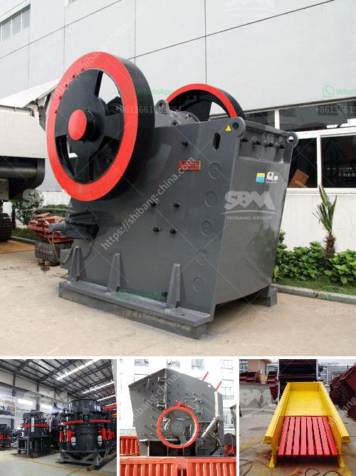

<h3>nigeria vertical mill machine</h3>
Nigeria, as Africa's largest economy, has been making significant strides in its industrial sector. With a rapidly growing population and increasing demand for goods and services, the manufacturing industry is poised for expansion. One crucial element in this growth trajectory is the Nigeria vertical mill machine, a cutting-edge technology that is revolutionizing the industry.

Vertical mill machines are advanced industrial equipment used to grind or crush materials into smaller particles. Unlike traditional horizontal mills, vertical mills use a spindle that vertically moves the grinding wheel or cutting tool. This unique design enables the machine to perform precise, high-precision operations, making it a preferred choice for various industries.

One of the primary advantages of vertical mill machines is their versatility. These machines can handle diverse materials, such as metal, wood, plastics, and even food products. The ability to process multiple materials expands the range of industries that can benefit from this technology. From automobile manufacturing to food processing, vertical mill machines bring efficiency and accuracy to numerous sectors across Nigeria.

The vertical mill machine's precision and reliability make it an indispensable tool for the manufacturing industry. With advanced control systems and computer-aided design (CAD) capabilities, operators can program the machine to perform highly complex tasks with minimal human intervention. This reduces the chances of errors and ensures consistent quality in the final product.

Additionally, the vertical mill machine's compact design and small footprint contribute to its popularity among Nigerian manufacturers. Space is often a constraint in many industrial facilities, and the vertical mill machine's ability to fit into tight spaces enables businesses to optimize their floor plans. This efficiency in space utilization can lead to increased productivity and cost savings for Nigerian manufacturers.

Moreover, vertical mill machines play a crucial role in promoting sustainability and environmental consciousness. Many vertical mills are equipped with advanced dust and fume extraction systems, efficiently collecting and removing harmful particles generated during the machining process. These systems ensure a clean and healthy working environment while minimizing the impact on the surrounding ecosystem.

The adoption of vertical mill machines in Nigeria also aligns with global trends. As technology continues to advance, traditional manufacturing processes are being replaced by more sophisticated and efficient methods. Vertical mill machines are at the forefront of this transformation, helping Nigerian manufacturers keep up with international standards and increase their competitiveness in the global market.

To fully realize the benefits of vertical mill machines, adequate infrastructure and skilled workforce are essential. The Nigerian government and industry stakeholders must collaborate to provide necessary training programs and create an enabling environment for investment in this sector. Additionally, partnerships with international manufacturers and technology providers can facilitate the transfer of knowledge and expertise, further driving the growth of this industry.

In conclusion, Nigeria's vertical mill machine is a game-changer in the country's industrial landscape. With its versatility, precision, and efficiency, this technology is poised to enhance the manufacturing sector and boost economic growth. The adoption of vertical mill machines aligns with global trends and positions Nigerian manufacturers on par with international standards. However, to fully leverage the potential of this technology, collaboration and investment in infrastructure and skills are critical. With the right support, Nigeria can unlock the true potential of vertical mill machines and accelerate its industrial development.
<h3>Contact us</h3><ul><li><strong>Whatsapp:&nbsp;<a href="https://wa.me/8613661969651">+8613661969651</a></strong></li><li><a href="https://swt.shibang-china.com/?git&amp;zhl&amp;nigeria vertical mill machine"><strong>Online Service(chat now)</strong></a></li></ul><h3>Related</h3><ul><li><a href='mobile crusher hire durban.md'>mobile crusher hire durban</a></li><li><a href='manufacturing of talcum powder.md'>manufacturing of talcum powder</a></li><li><a href='limestone crushing machines.md'>limestone crushing machines</a></li><li><a href='cone crusher device.md'>cone crusher device</a></li><li><a href='price of raymond used for crushing the powder stones.md'>price of raymond used for crushing the powder stones</a></li></ul>