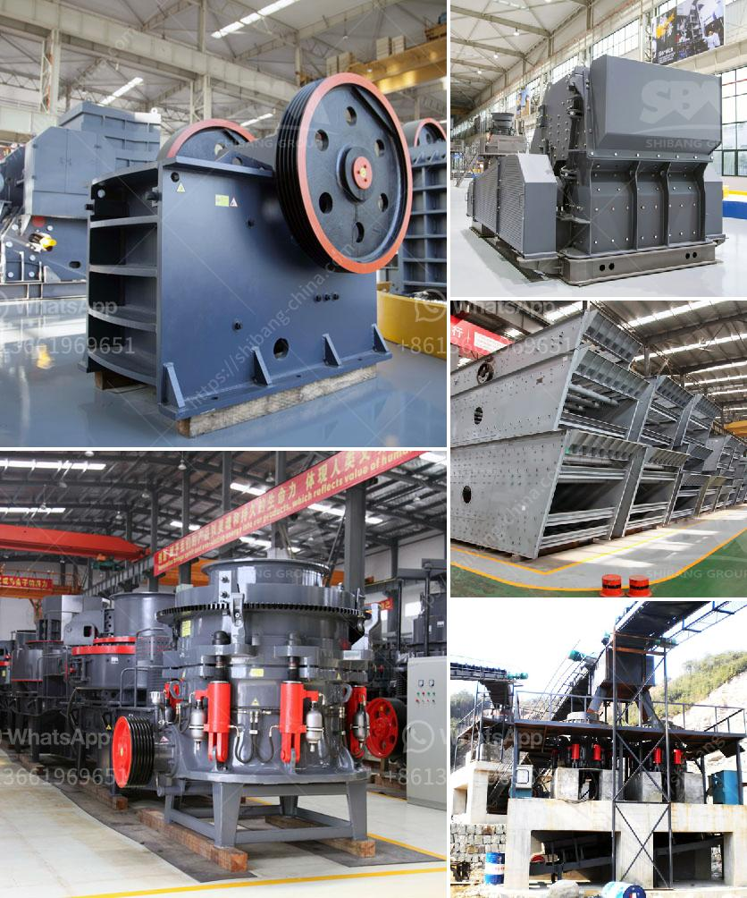

<h3>operation hammer mill</h3>
Operation Hammer Mill is a unique initiative that targets drug traffickers and criminals in an effort to stop the illegal drug trade. This operation, led by law enforcement agencies, aims to bring justice to those who profit from the misery of addiction and the destruction caused by illegal substances.

The name "Hammer Mill" derives from a method used to crush and grind substances into smaller pieces. This analogy perfectly reflects the goal of the operation - to break down and dismantle the networks and organizations that facilitate drug trafficking.

The operation involves extensive surveillance, intelligence gathering, and coordination between local, state, and federal law enforcement agencies. Undercover agents infiltrate these criminal organizations and gather evidence, building a strong case against key players in the drug trade.

Once enough evidence is gathered, law enforcement executes a series of carefully planned raids, targeting the identified criminals and seizing drugs, money, and assets acquired through illegal means. The operation aims to disrupt the drug trade by cutting off the flow of drugs, dismantling supply chains, and prosecuting those involved.

Operation Hammer Mill has achieved significant success since its inception. It has led to numerous arrests, dismantling of drug networks, and the seizure of large quantities of illegal substances. The operation not only aims to curb drug trafficking but also to disrupt other criminal activities, such as money laundering and violence associated with the drug trade.

Furthermore, this operation serves as a deterrent for those involved in the drug trade, as it demonstrates the tenacity and determination of law enforcement agencies to bring criminals to justice. It sends a strong message that drug trafficking will not be tolerated and that the consequences for those involved will be severe.

In conclusion, Operation Hammer Mill is a crucial undertaking in the fight against drug trafficking. Its strategic approach, utilizing intelligence, surveillance, and coordinated law enforcement efforts, has proven successful in disrupting organized criminal networks. By targeting drug traffickers, seizing assets, and prosecuting offenders, this operation aims to protect communities and save lives affected by the scourge of drugs.
<h3>Contact us</h3><ul><li><strong>Whatsapp:&nbsp;<a href="https://wa.me/8613661969651">+8613661969651</a></strong></li><li><a href="https://swt.shibang-china.com/?git&amp;zhl&amp;operation hammer mill"><strong>Online Service(chat now)</strong></a></li></ul><h3>Related</h3><ul><li><a href='used industrial gravel making equipment.md'>used industrial gravel making equipment</a></li><li><a href='fine grinding mills.md'>fine grinding mills</a></li><li><a href='stone crusher supplier.md'>stone crusher supplier</a></li><li><a href='roller mill process machine.md'>roller mill process machine</a></li><li><a href='used concrete crusher price in uk.md'>used concrete crusher price in uk</a></li></ul>