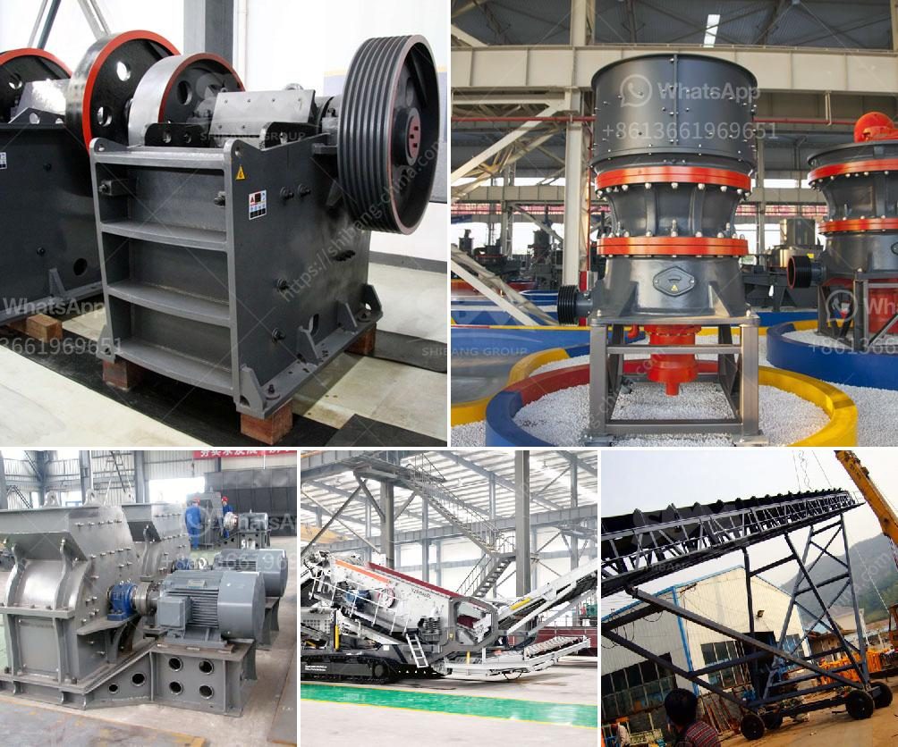

<h3>overland conveyor belt system cost estimates</h3>
Overland conveyor belt systems are widely used in mining, aggregate, and other industries due to their efficiency and reliability in transporting bulk materials over long distances. These systems consist of a series of conveyor belts that are stretched between two or more pulleys and are supported by idlers. While overland conveyor belt systems offer numerous advantages, it is essential to consider the cost estimates involved in the installation and operation of these systems.

The cost of an overland conveyor belt system is determined by several factors. One of the main factors is the length of the system. Longer systems require more belts, more supports, and more power to operate, leading to increased costs. The terrain and topography of the area where the system will be installed also play a role in determining costs. Systems that traverse mountains, valleys, or difficult terrains may require additional engineering, higher-quality materials, and increased maintenance, adding to the overall cost.

Another significant factor in cost estimates is the capacity of the system. Higher capacity systems require larger belts, more powerful drives, and stronger structures to support the increased load. These components are usually more expensive, driving up the overall cost of the system.

Material handling requirements are also considered when estimating costs. Different types of materials have different handling characteristics, such as weight, size, and abrasiveness. Systems that handle heavy or abrasive materials may require specialized belts, drive systems, and idlers, increasing the overall cost.

Furthermore, the choice of conveyor belt design also affects cost estimates. There are several types of conveyor belts available, including fabric belts, steel cord belts, and solid woven belts. Each type has different characteristics and cost implications. For example, steel cord belts are generally more expensive but offer higher tensile strength, making them suitable for heavy-duty applications.

Additionally, ancillary equipment required for the system, such as loading and unloading stations, transfer towers, and emergency stop systems, should be taken into account when estimating costs. These components are essential for the smooth operation and safety of the system but add to the overall expenses.

Operation and maintenance costs should be considered in the overall cost estimates as well. Regular inspections, preventive maintenance, and routine repairs are necessary to ensure the longevity and reliability of the conveyor system. The cost of spare parts, labor, and any necessary professional support should also be factored into the estimates.

To accurately estimate the cost of an overland conveyor belt system, it is essential to consult with experienced engineers or consultants who specialize in conveyor system design and installation. They can provide detailed cost estimates tailored to the specific requirements of the project, taking into account the length, capacity, materials, terrain, and other factors.

In conclusion, cost estimates for overland conveyor belt systems depend on various factors, including the length, capacity, terrain, and material handling requirements. The choice of conveyor belt design and the installation of ancillary equipment also impact costs. While these systems provide numerous benefits in terms of efficiency and reliability, it is crucial to consider the cost implications before undertaking a project. Seeking expert advice and conducting a thorough analysis of cost estimates will help ensure the successful implementation of an overland conveyor belt system.
<h3>Contact us</h3><ul><li><strong>Whatsapp:&nbsp;<a href="https://wa.me/8613661969651">+8613661969651</a></strong></li><li><a href="https://swt.shibang-china.com/?git&amp;zhl&amp;overland conveyor belt system cost estimates"><strong>Online Service(chat now)</strong></a></li></ul><h3>Related</h3><ul><li><a href='ball mill construction.md'>ball mill construction</a></li><li><a href='contribution of quarrying in nigeria economy.md'>contribution of quarrying in nigeria economy</a></li><li><a href='mobile crushing station philippines.md'>mobile crushing station philippines</a></li><li><a href='sample of a business proposal for a block factory.md'>sample of a business proposal for a block factory</a></li><li><a href='vertical ball grinding mills.md'>vertical ball grinding mills</a></li></ul>