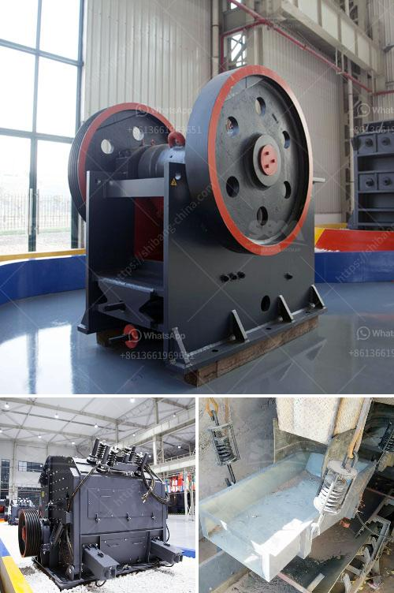

<h3>pakistan crusher machine complete</h3>
Pakistan is rich in mineral resources and mining industry is considered as one of the important sectors driving the economic development. With vast reserves of various kinds of minerals such as coal, copper, gold, chromite, limestone, bauxite and many others, Pakistan ranks among top producers of gemstone and marble. In recent years, the infrastructure development in Pakistan has created a huge demand for various types of construction materials, resulting in a boom in the construction industry. This, in turn, has increased the demand for crusher machines.

A crusher machine is essentially a piece of equipment which uses mechanical energy to break rocks into small pieces. It is commonly used in mining, metallurgical industry, construction, road construction and chemical industry. Pakistan has abundant stone resources, such as granite, marble, sandstone, limestone, etc. Hammering down these stones into small pieces is desired for various types of construction projects, like building roads, bridges, buildings, factories, etc. Therefore, investing in a crusher machine for your construction projects can significantly improve your productivity and efficiency.

There are various types of crusher machines available in the market, such as jaw crusher, impact crusher, cone crusher, vertical shaft impact crusher, and so on. Different machines have different crushing capacities and functionalities. Some crushers are designed to crush large rocks into smaller rocks or gravel, while others are used for specific materials like coal. Depending on the nature of the material to be crushed and the desired output size, one can choose the most suitable crusher machine for their specific needs.

However, it is crucial to ensure that you purchase high-quality crusher machines to achieve desired results. In Pakistan, there are many crusher machine manufacturers and suppliers, who provide high-quality machines with competitive prices. Crusher machines have wide applications in various industries, such as mining, construction, metallurgy, chemistry, highway, railway, water conservancy and others.

In the mining industry, crushers are used to crush ores into smaller particles for further processing. They can be used for primary crushing, secondary crushing and tertiary crushing. Additionally, crushers can also be used to crush hard and brittle materials like rocks, ores, refractory materials, cement clinker, quartzite, iron ore, concrete aggregate, etc.

To cater to the diverse needs of the market, crusher machines come in different sizes and capacities. Some machines are designed to crush materials in a batch process, while others are continuous feeders. The size of the machine and its capacity determine the efficiency and productivity of the crushing process.

Moreover, crusher machines are also used in recycling operations. They can shred and crush various materials such as glass, plastic, rubber, metal, paper, etc. Recycling machines help in reducing waste materials and conserving natural resources, making them an essential component of sustainable development.

In conclusion, crusher machines play a crucial role in Pakistan's construction industry and mining sector. By investing in a high-quality crusher machine, one can ensure the efficient and effective crushing of stones and ores, contributing to the overall development of the country. It is recommended to choose a trusted manufacturer or supplier to acquire the best crusher machine that suits your specific needs.
<h3>Contact us</h3><ul><li><strong>Whatsapp:&nbsp;<a href="https://wa.me/8613661969651">+8613661969651</a></strong></li><li><a href="https://swt.shibang-china.com/?git&amp;zhl&amp;pakistan crusher machine complete"><strong>Online Service(chat now)</strong></a></li></ul><h3>Related</h3><ul><li><a href='grinding of copper ores.md'>grinding of copper ores</a></li><li><a href='stone crushing machine in kenya.md'>stone crushing machine in kenya</a></li><li><a href='manufacturer of clinker grinding machine.md'>manufacturer of clinker grinding machine</a></li><li><a href='vertical mills retention time formula.md'>vertical mills retention time formula</a></li><li><a href='rock crusher unit.md'>rock crusher unit</a></li></ul>