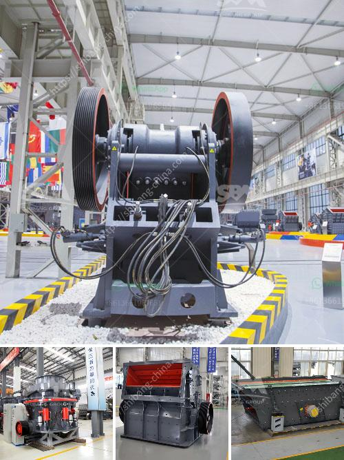

<h3>pe 200 x 300 stone crusher</h3>
The PE 200 x 300 stone crusher is a popular and versatile machine that is used in many industries across the world. It is designed to crush stones and rocks of various sizes and hardness levels, from cobblestone to granite. The machine is commonly used for primary crushing of materials, making it an essential tool in the construction and mining industries.

With a maximum feeding size of 180mm and a displacement capacity of 3-10 cubic meters per hour, the PE 200 x 300 stone crusher is capable of crushing even the toughest materials. Its sturdy construction and robust design ensure a reliable performance, making it a valuable asset for any project.

One of the key features of this stone crusher is its adjustable output size. By adjusting the gap between the impact rack and rotor, the size of the final product can be controlled. This enables users to produce stones of different sizes according to their specific requirements.

The PE 200 x 300 stone crusher is also equipped with an overload protection device. This feature ensures that the machine automatically stops working when it encounters an excessive load or inputs that may damage the equipment. As a result, the machine's lifespan is prolonged, reducing maintenance and repair costs.

Moreover, the stone crusher operates with low noise and vibration levels, providing a safe and comfortable working environment. Its compact size and lightweight design make it easy to transport and install, allowing for quick and efficient setup on different job sites.

In conclusion, the PE 200 x 300 stone crusher is a versatile machine that offers predictable and consistent performance. Its adjustable output size, overload protection, and low noise levels make it an ideal choice for a wide range of applications. Whether it is for crushing stones for road construction or breaking down rocks in a quarry, this machine is a reliable and efficient tool that delivers results.
<h3>Contact us</h3><ul><li><strong>Whatsapp:&nbsp;<a href="https://wa.me/8613661969651">+8613661969651</a></strong></li><li><a href="https://swt.shibang-china.com/?git&amp;zhl&amp;pe 200 x 300 stone crusher"><strong>Online Service(chat now)</strong></a></li></ul><h3>Related</h3><ul><li><a href='ball mills for sale.md'>ball mills for sale</a></li><li><a href='stone crusher machine usato in italy.md'>stone crusher machine usato in italy</a></li><li><a href='aggregates for concrete crusher in nigeria.md'>aggregates for concrete crusher in nigeria</a></li><li><a href='mining processing machine prices.md'>mining processing machine prices</a></li><li><a href='gold ore processing equipment in south africa.md'>gold ore processing equipment in south africa</a></li></ul>