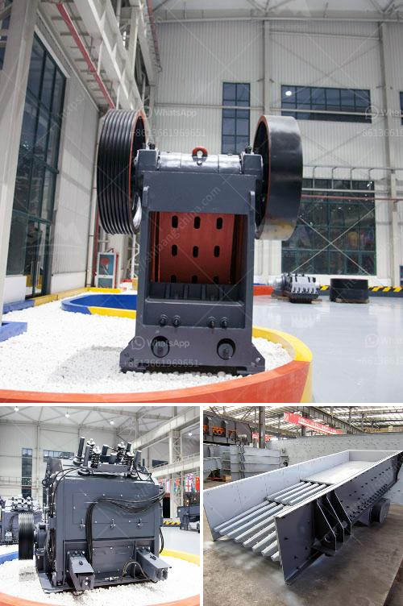

<h3>pe series jaw crusher and ton per day</h3>
PE series jaw crusher is a commonly used type of crusher in industrial applications. It is primarily used for crushing various materials with a compressive strength of less than 320MPa, such as limestone, coal, gypsum, cement clinker, and other materials. The PE series jaw crusher is suitable for coarse crushing of large materials, while the PEX series jaw crusher is suitable for medium and fine crushing of smaller materials.

One of the main advantages of the PE series jaw crusher is its ability to process large materials efficiently. It has a deep crushing cavity and a larger feed opening, which allows it to handle materials with a larger size than other types of crushers. This feature makes it an ideal choice for applications that require the crushing of large rocks, ores, or other materials. Additionally, the PE series jaw crusher has a simple structure and reliable operation, making it easy to maintain and repair, reducing downtime and increasing productivity.

Another significant advantage of the PE series jaw crusher is its high crushing efficiency. The crusher has a high crushing ratio, which means that the size of the material is reduced in one step. This increases the efficiency of the crushing process and saves energy. Additionally, the PE series jaw crusher has a large stroke, which ensures a higher crushing ratio and more uniform product size. This feature contributes to higher productivity and a better overall performance.

The PE series jaw crusher has a wide range of applications in various industries. It is commonly used in the mining industry for crushing materials such as granite, marble, basalt, limestone, quartz, cobble, iron ore, copper ore, and other minerals. It is also used in the construction industry for crushing concrete, bricks, stones, and other construction materials. Moreover, the PE series jaw crusher is used in the chemical industry for crushing various chemicals and raw materials.

When it comes to the capacity of the PE series jaw crusher, it can process materials from 1 ton per day to several hundred tons per day. With its high efficiency and large feed opening, the crusher can handle even the toughest materials. The exact capacity of the crusher depends on the size and type of the feed material, as well as the desired product size. Overall, the PE series jaw crusher is a versatile and efficient crushing machine that is widely used in various industries.

In conclusion, the PE series jaw crusher is a versatile and efficient crushing machine that is widely used in various industries. It has a deep crushing cavity, a large feed opening, and a high crushing efficiency, making it suitable for crushing large materials. Furthermore, it has a simple structure and reliable operation, which makes it easy to maintain and repair. With a capacity ranging from 1 ton per day to several hundred tons per day, the PE series jaw crusher is a reliable choice for any industrial application.
<h3>Contact us</h3><ul><li><strong>Whatsapp:&nbsp;<a href="https://wa.me/8613661969651">+8613661969651</a></strong></li><li><a href="https://swt.shibang-china.com/?git&amp;zhl&amp;pe series jaw crusher and ton per day"><strong>Online Service(chat now)</strong></a></li></ul><h3>Related</h3><ul><li><a href='uk made stone crushing machine.md'>uk made stone crushing machine</a></li><li><a href='barite mill specifications.md'>barite mill specifications</a></li><li><a href='top german mining equipment manufacturers.md'>top german mining equipment manufacturers</a></li><li><a href='gold mining mining gold mining cost.md'>gold mining mining gold mining cost</a></li><li><a href='stone manufacturing process.md'>stone manufacturing process</a></li></ul>