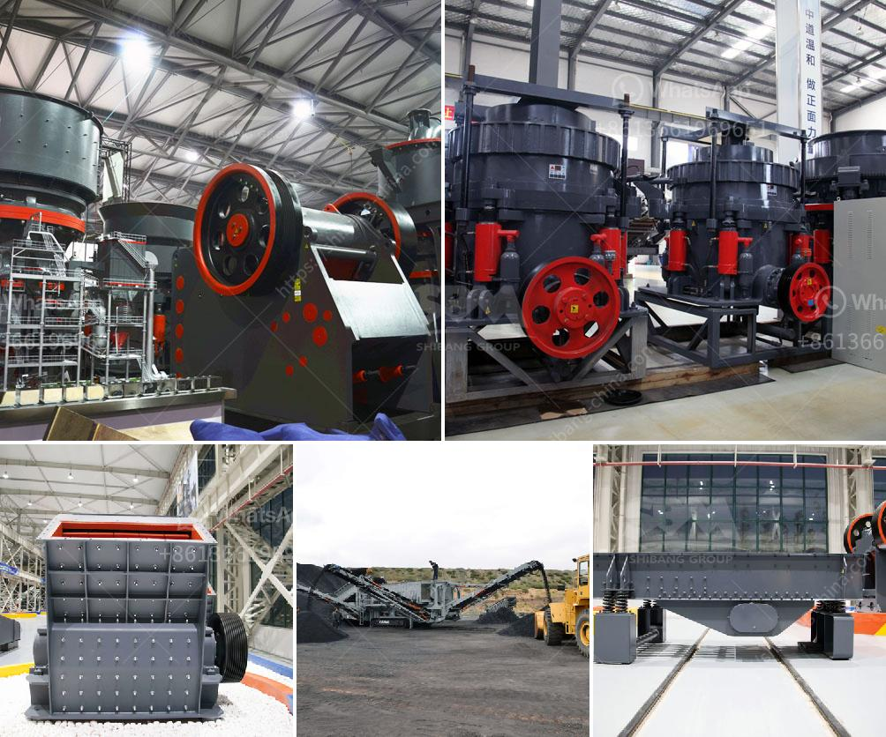

<h3>pebble crusher for sale</h3>
In the pebble crushing industry, choosing the right equipment is vital because it determines the final product quality and quantity. Ensuring an efficient crushing process is crucial when dealing with large amounts of pebbles. Fortunately, the pebble crusher for sale from reputable manufacturers is designed to crush efficiently, reducing various pebble sizes into desired aggregate materials for construction purposes.

One excellent example is the pebble crusher that JXSC offers. Started in 1985, JXSC has been in the mining and crushing industry for over 35 years, providing highly reliable machines for customers worldwide. Currently, there are several series of pebble crushers available, each with different specifications and capabilities.

The pebble crusher for sale from JXSC has many advantages such as continuous operation, high productivity, low power consumption per unit, and uniform particle size. It is widely used in fine crushing of various minerals and stones for various industrial sectors such as metallurgy, mining, building materials, highways, railways, water conservancy, and chemical industries.

The specific crushing process is as follows: The pebble crusher is a simplified and optimized crushing chamber, which is mainly composed of a fixed jaw plate, a moving jaw plate, a side guard plate, an eccentric shaft, a toggle plate, and a few movable jaw component parts. Its crushing chamber is deep, so it can cope with more stone materials, even in the bumpy working conditions, making it an ideal choice for crushing large-sized pebbles.

Furthermore, JXSC provides after-sales service throughout the lifetime of the pebble crusher for sale. With professional technical support, users can get on-site guidance, maintenance support, and quick parts replacement when needed. This service ensures the equipment's smooth operation and uninterrupted productivity for extended periods.

In conclusion, the pebble crusher for sale from JXSC is a highly efficient equipment that can reduce pebble run into desired aggregate materials in mineral processing, chemistry, construction materials, infrastructure, and other industries. Thanks to its low power consumption, high efficiency, and reliable performance, it has become the ideal option for crushing pebbles. Interested buyers can contact JXSC for further information or direct purchase.
<h3>Contact us</h3><ul><li><strong>Whatsapp:&nbsp;<a href="https://wa.me/8613661969651">+8613661969651</a></strong></li><li><a href="https://swt.shibang-china.com/?git&amp;zhl&amp;pebble crusher for sale"><strong>Online Service(chat now)</strong></a></li></ul><h3>Related</h3><ul><li><a href='portable gold recovery mill for sale.md'>portable gold recovery mill for sale</a></li><li><a href='latest three roll mills.md'>latest three roll mills</a></li><li><a href='smallest cement plant.md'>smallest cement plant</a></li><li><a href='agen jaw crusher kenya.md'>agen jaw crusher kenya</a></li><li><a href='crusher machine seller.md'>crusher machine seller</a></li></ul>