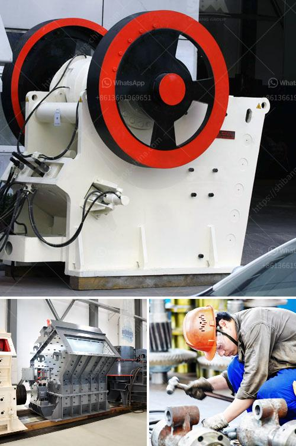

<h3>pebble crusher shanghai manufacturers</h3>
Title: Insights into Pebble Crusher Manufacturers in Shanghai: A Prominent Hub for Crushing and Mining Equipment

Pebble crushing is an arduous task in the field of mine operations and quarrying. With the worldwide demand for highly efficient and cost-effective crushing equipment, pebble crusher manufacturers in Shanghai, China, are experiencing a surge in their market presence. Though it is possible to find manufacturers globally, an increasing number of businesses from various corners of the world are turning to Shanghai for high-quality crushing solutions at competitive prices.

As one of the most populous cities in China, Shanghai has emerged as a global hub for manufacturing, providing a wide range of cost-effective industrial solutions across various sectors. With its advanced infrastructure, convenient transport links, and availability of skilled labor, Shanghai is an ideal location for manufacturing industries, including those specializing in crusher machinery.

A plethora of manufacturers in Shanghai specializes in the production of high-performance crushing equipment, catering to the unique requirements of mines, quarries, and construction sites around the world. These manufacturers leverage cutting-edge technologies and advanced production methods to deliver efficient and reliable pebble crushers.

One such prominent manufacturer in Shanghai is Shanghai Shibang Machinery Co., Ltd., known for their extensive range of crushers and screens. They have been providing the mining industry with high-quality equipment for over decades, earning a reputation for durable and reliable machinery. Their pebble crushers have gained worldwide recognition for their superior performance, efficiency, and affordability.

1. Robust Construction: Shanghai pebble crushers are built with high-strength materials to withstand heavy loads and harsh operating conditions. Their sturdy construction ensures durability, minimizing downtime and reducing maintenance costs.

2. High Crushing Efficiency: These crushers are designed to maximize crushing efficiency, ensuring the production of uniform-sized particles. With their optimized crushing chambers and precise settings, Shanghai crushers enable operators to achieve maximum productivity.

3. Superior Safety Features: Ensuring the well-being of operators and preventing accidents is a top priority for Shanghai manufacturers. Their pebble crushers come equipped with advanced safety features, including emergency stop buttons, electrical protection devices, and belt guards.

4. Environmental Friendliness: Shanghai crushers incorporate environmentally-friendly technologies, such as dust control systems and noise reduction mechanisms, to minimize the impact on the surrounding environment and maintain compliance with local regulations.

5. Customization Options: Shanghai manufacturers understand the varying needs of their customers. They offer a range of pebble crushers that can be tailored to meet specific requirements, including different crushing capacities, input sizes, and discharge options.

As the demand for pebble crushers continues to rise, Shanghai manufacturers are poised to play a crucial role in meeting market demands. With their advanced manufacturing capabilities, adherence to stringent quality standards, and competitive pricing, Shanghai manufacturers have become a go-to source for businesses seeking reliable and efficient pebble crushing solutions. As technology continues to evolve, we can expect these manufacturers to lead the way in developing innovative and sustainable crushing equipment to address the ever-changing needs of the industry.
<h3>Contact us</h3><ul><li><strong>Whatsapp:&nbsp;<a href="https://wa.me/8613661969651">+8613661969651</a></strong></li><li><a href="https://swt.shibang-china.com/?git&amp;zhl&amp;pebble crusher shanghai manufacturers"><strong>Online Service(chat now)</strong></a></li></ul><h3>Related</h3><ul><li><a href='quarry crusher manufacturer.md'>quarry crusher manufacturer</a></li><li><a href='crusher for construction price.md'>crusher for construction price</a></li><li><a href='crushing equipment in south africa.md'>crushing equipment in south africa</a></li><li><a href='concrete waste crushing and iron.md'>concrete waste crushing and iron</a></li><li><a href='cement grinding ball mill process.md'>cement grinding ball mill process</a></li></ul>