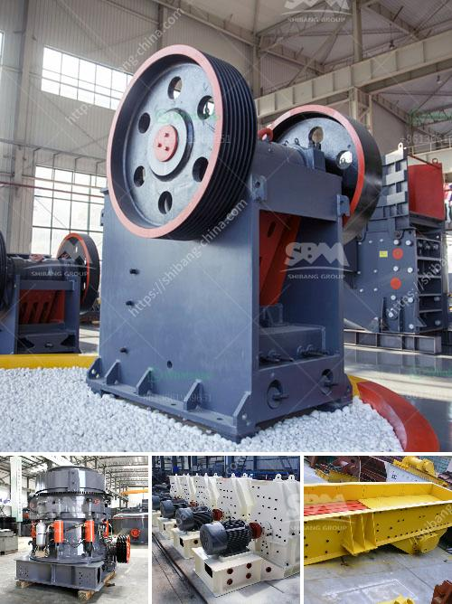

<h3>petroleum coke crushing plant</h3>
Petroleum coke, or pet coke, is derived from oil refinery coker units or other cracking processes. This carbon-rich solid material is a byproduct of the oil refining industry and is primarily used for electricity generation and as a fuel source for industrial processes. However, pet coke needs to be crushed before it can be efficiently used. That's where the petroleum coke crushing plant comes into play.

Petroleum coke crushing plant is a key part of the process of producing coke for the blast furnace in an integrated steel plant. The crushing process is carried out to reduce the size of pet coke for use in the calcining process, which is a thermal-mechanical treatment to convert petroleum coke into high-quality green coke.

The petroleum coke crushing plant includes a vibrating feeder, a jaw crusher, an impact crusher or cone crusher, a vibrating screen, belt conveyors, and a control system. These different crushing machines can be combined to form a complete crushing plant, which produces different specifications of pet coke particles.

The primary crusher in the petroleum coke crushing plant is a single-roll crusher, equipped with hydraulic adjustment capabilities to ensure the desired product size. Secondary and tertiary crushers are usually cone or impact crushers. The crushed material is then screened using a vibrating screen before being sent to the storage silos.

A well-designed petroleum coke crushing plant efficiently crushes and screens pet coke to provide a consistent feed material for the subsequent calcining process. The installation of dust collection and air pollution control equipment is also essential to minimize emissions and ensure environmental compliance.

In conclusion, the petroleum coke crushing plant plays a critical role in the coke production process. It ensures the pet coke is properly crushed, screened, and stored to meet the specific requirements of the calcining process. By investing in a high-quality crushing plant, steel plants can maximize their efficiency, reduce emissions, and produce high-quality coke for industrial use.
<h3>Contact us</h3><ul><li><strong>Whatsapp:&nbsp;<a href="https://wa.me/8613661969651">+8613661969651</a></strong></li><li><a href="https://swt.shibang-china.com/?git&amp;zhl&amp;petroleum coke crushing plant"><strong>Online Service(chat now)</strong></a></li></ul><h3>Related</h3><ul><li><a href='vertical mills retention time formula.md'>vertical mills retention time formula</a></li><li><a href='stone crusher for sale in south africa.md'>stone crusher for sale in south africa</a></li><li><a href='200tph gold ore processing plant.md'>200tph gold ore processing plant</a></li><li><a href='stone crusher supplier.md'>stone crusher supplier</a></li><li><a href='rock crushing and ballast.md'>rock crushing and ballast</a></li></ul>