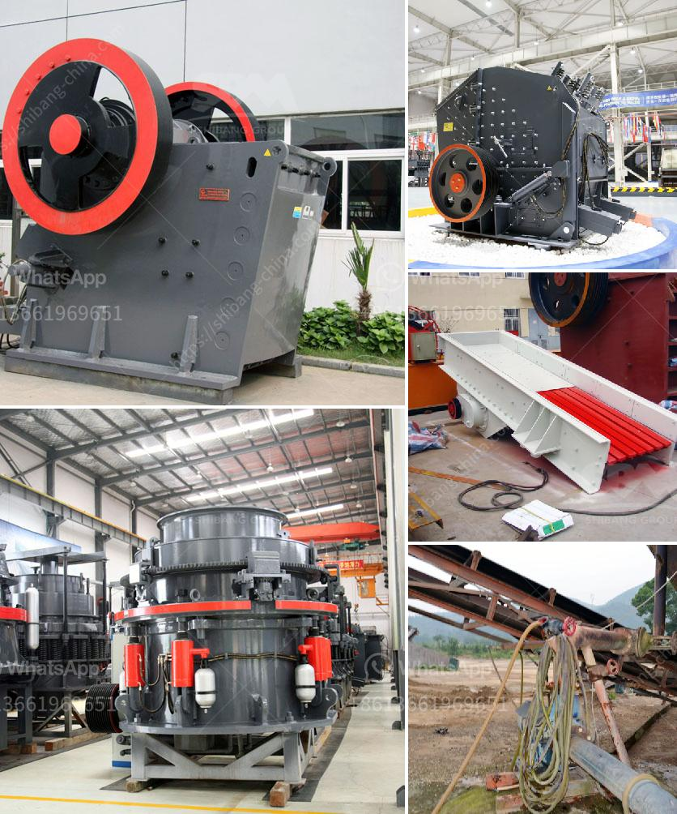

<h3>philippine gold processing refining</h3>
The Philippines has a rich history of gold mining and processing. The country is well-known for its abundance of mineral resources, attracting both local and foreign investors.

Gold processing and refining in the Philippines take place in various locations across the country. There are several companies and individuals involved in the industry, each playing a crucial role in the entire process.

The initial stage of gold processing involves mining the ore from various gold-rich areas. Miners employ different techniques such as open-pit mining, underground mining, and alluvial mining to extract the precious metal. Once the ore is obtained, it is transported to a processing plant for further refinement.

Gold refining is an essential step in the process, aimed at removing impurities and enhancing the quality of the gold. There are various techniques used for gold refining, including the Miller process, Wohlwill process, and aqua regia process. These methods involve the use of chemicals and high temperatures to purify the gold to its highest possible level of purity.

After the gold has been refined, it is then cast into bars, coins, or other desired forms. These products are then sent to various markets, both domestic and international, where they are traded, sold, and used for various purposes such as jewelry making, investment, and industrial applications.

Gold processing and refining in the Philippines provide employment opportunities for many Filipinos, contributing to the country's economic growth. Additionally, it plays a significant role in generating revenue for the government through taxes and royalties.

However, it is crucial to ensure responsible and sustainable gold processing and refining practices to minimize environmental impacts and promote the welfare of communities involved in the industry. The government and stakeholders should work together to implement regulations and standards that prioritize safety, environmental protection, and fair labor practices.

In conclusion, gold processing and refining in the Philippines are essential components of the country's mining industry. With responsible practices and adherence to regulations, gold mining can continue to contribute to economic development while protecting the environment and the welfare of the people.
<h3>Contact us</h3><ul><li><strong>Whatsapp:&nbsp;<a href="https://wa.me/8613661969651">+8613661969651</a></strong></li><li><a href="https://swt.shibang-china.com/?git&amp;zhl&amp;philippine gold processing refining"><strong>Online Service(chat now)</strong></a></li></ul><h3>Related</h3><ul><li><a href='used stone cutting machine from japan.md'>used stone cutting machine from japan</a></li><li><a href='portable conveyor belts for sale.md'>portable conveyor belts for sale</a></li><li><a href='gravel crusher supplier in the philippines.md'>gravel crusher supplier in the philippines</a></li><li><a href='tertiary impact crushers for quartz.md'>tertiary impact crushers for quartz</a></li><li><a href='ball mill grinding mill.md'>ball mill grinding mill</a></li></ul>