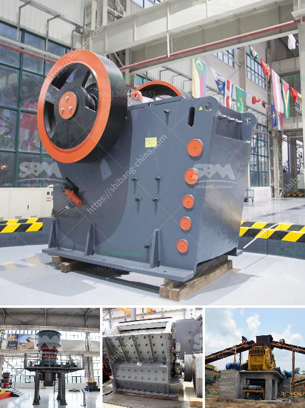

<h3>plans for making a miniature jaw crusher</h3>
In the modern world, there is a growing need for efficient recycling tools. Many industries are actively looking for ways to reduce waste and to recycle materials efficiently. One such tool that has found its importance in the recycling industry is the jaw crusher. A jaw crusher is a device that reduces the size of various solid materials in many applications, including underground mining, construction waste recycling, and concrete recycling. The miniature jaw crusher is a small and portable machine designed to reduce waste and bring convenience to those who generate waste on a regular basis.

The small jaw crusher consists of a motor, a pulley, a flywheel, a movable jaw, a side guard plate, an elbow plate, a back seat of the elbow plate, an adjusting screw, a return spring, a fixed jaw plate, and a movable jaw plate. It crushes rocks by squeezing them between the two jaws.

To make a miniature jaw crusher, one needs to understand the material properties and requirements of the device. The most common materials used in making a miniature jaw crusher include cast iron, steel, and aluminum. These materials possess the required strength and durability to withstand the crushing process.

The assembly process involves connecting and securing the various components together. The motor is connected to the pulley, and the pulley is connected to the flywheel. The movable jaw is attached to the flywheel, and the fixed jaw is secured to the frame of the crusher. The side guard plate, elbow plate, and back seat of the elbow plate are attached to the frame and provide support and stability to the jaws.

A miniature jaw crusher offers several advantages in the recycling industry. Firstly, it is portable and can be easily transported to different locations. This allows recycling facilities to bring the crusher to the waste generation site, reducing transportation costs and saving time.

Secondly, a small jaw crusher is cost-effective and requires minimal maintenance. The simple design and construction of the crusher result in fewer moving parts, reducing the chances of mechanical failure and the need for frequent repairs.

Lastly, a miniature jaw crusher is highly versatile. It can be used to crush a wide range of materials, such as concrete, rocks, asphalt, and construction waste. This makes it suitable for various recycling applications and enables the recycling of a wide array of waste materials.

The need for efficient recycling tools is increasing, and a miniature jaw crusher can play a significant role in this endeavor. Designing and assembling a small jaw crusher requires careful consideration of materials and construction techniques. The benefits of a miniature jaw crusher include portability, cost-effectiveness, and versatility. With a miniature jaw crusher, waste generation sites can conveniently reduce the size of various materials and enable efficient recycling processes. Overall, investing in a miniature jaw crusher can greatly contribute to the sustainable and responsible management of waste.
<h3>Contact us</h3><ul><li><strong>Whatsapp:&nbsp;<a href="https://wa.me/8613661969651">+8613661969651</a></strong></li><li><a href="https://swt.shibang-china.com/?git&amp;zhl&amp;plans for making a miniature jaw crusher"><strong>Online Service(chat now)</strong></a></li></ul><h3>Related</h3><ul><li><a href='slag ball mill crusher.md'>slag ball mill crusher</a></li><li><a href='stone crusher supplier.md'>stone crusher supplier</a></li><li><a href='manufacturer of clinker grinding machine.md'>manufacturer of clinker grinding machine</a></li><li><a href='cobble crusher supplier.md'>cobble crusher supplier</a></li><li><a href='concrete crusher kenya.md'>concrete crusher kenya</a></li></ul>