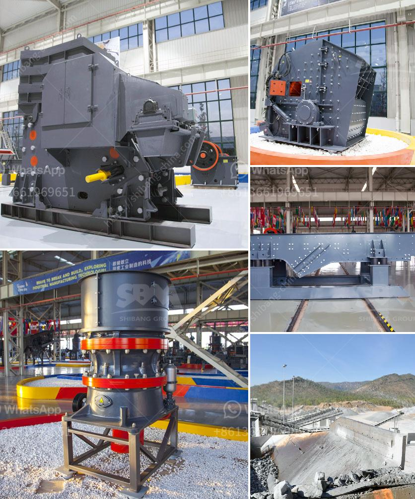

<h3>plant equipment list for cost estimation</h3>
When undertaking a construction project, it is crucial to have a plant equipment list to accurately estimate costs. Plant equipment refers to the machinery, tools, and vehicles needed to carry out various tasks on the site. By compiling a comprehensive list, project managers can determine the type and quantity of equipment required, helping them calculate expenses more effectively.

The first step in creating a plant equipment list is to identify the equipment needed for each stage of the project. This may include excavators, bulldozers, cranes, loaders, compactors, and generators. Different construction activities such as earthmoving, digging, leveling, compacting, and lifting require specific machinery, which should be noted down accordingly.

Additionally, it is essential to consider the duration of equipment usage. Some machines may be leased or hired for short-term usage, while others may be owned by the contractor. All relevant machinery should be included on the list along with their respective rental or purchase costs.

Other considerations include fuel consumption, maintenance, and operator wages. Each equipment item has different fuel requirements and maintenance schedules, which impact the overall project budget. Additionally, operators' wages should be factored in, as they are an integral part of equipment usage.

Lastly, project managers should account for any safety equipment or accessories necessary for the smooth operation of the machinery. This may include safety vests, helmets, harnesses, and barricades. It is crucial to include these items on the list to ensure adherence to safety protocols and regulations.

In conclusion, a detailed plant equipment list is vital for cost estimation in construction projects. By identifying the necessary machinery, considering rental or purchase costs, factoring in fuel consumption and maintenance, including operator wages, and accounting for safety equipment, project managers can accurately estimate expenses. By doing so, they can better plan and allocate resources, ensuring the project stays within budget and proceeds smoothly.
<h3>Contact us</h3><ul><li><strong>Whatsapp:&nbsp;<a href="https://wa.me/8613661969651">+8613661969651</a></strong></li><li><a href="https://swt.shibang-china.com/?git&amp;zhl&amp;plant equipment list for cost estimation"><strong>Online Service(chat now)</strong></a></li></ul><h3>Related</h3><ul><li><a href='quarry plant machinery.md'>quarry plant machinery</a></li><li><a href='stone crushers made in china.md'>stone crushers made in china</a></li><li><a href='price of raymond used for crushing the powder stones.md'>price of raymond used for crushing the powder stones</a></li><li><a href='sand washing plant process.md'>sand washing plant process</a></li><li><a href='limestone gypsum crusher machine.md'>limestone gypsum crusher machine</a></li></ul>