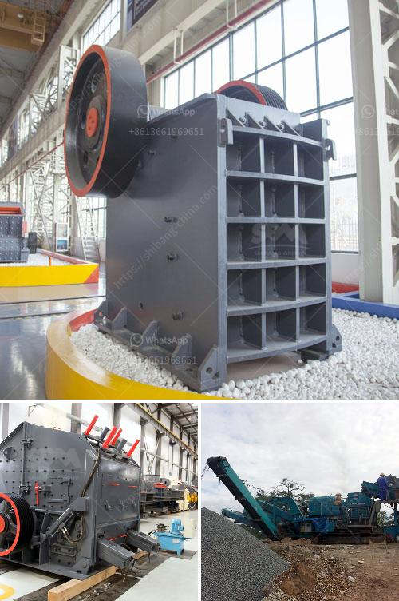

<h3>portable aggregate crushing plants</h3>
Portable aggregate crushing plants are a convenient and cost-effective solution for the crushing of construction materials. These plants can efficiently crush all types of materials, regardless of the hardness or abrasiveness. Moreover, portable aggregate crushing plants have been designed to be mobile and easy to transport, making them the perfect ally for on-site crushing operations.

One of the main advantages of portable aggregate crushing plants is their versatility. With multiple configuration options available, these plants can be customized to meet the specific needs of any project. Whether it is a small-scale construction site or a large-scale mining operation, portable aggregate crushing plants can adapt to different requirements.

Another key benefit of portable aggregate crushing plants is their efficiency. These plants are equipped with high-performance crushers that can handle large quantities of material in a short period. By reducing the need to transport materials to a stationary crushing plant, portable aggregate crushing plants minimize the overall cost of transportation and save time.

In addition to their efficiency, portable aggregate crushing plants also offer environmental benefits. By reducing the need to transport materials over long distances, these plants minimize carbon emissions associated with transportation. Furthermore, advancements in technology have made it possible for portable aggregate crushing plants to operate with lower noise levels. This is particularly beneficial for urban areas where noise regulations may be in place.

The concept of portability also brings to light the convenience of these plants in terms of site setup. Traditional crushing plants require a fixed foundation, whereas portable aggregate crushing plants don't. This translates to greater flexibility and ease of use. Portable plants can be conveniently moved from one location to another, allowing companies to quickly set up and start crushing operations.

When it comes to maintenance, portable aggregate crushing plants are also a viable option. These plants are designed with user-friendly features that make maintenance and repairs straightforward. In addition, most manufacturers offer comprehensive after-sales support, providing guidance and assistance to ensure the longevity and smooth operation of the plant.

In conclusion, portable aggregate crushing plants are a game-changer in the construction and mining industries. Their versatility, efficiency, and convenience make them the ideal choice for on-site crushing operations. By eliminating the need for transportation and enabling quick setup, these plants help companies minimize costs and maximize productivity. Furthermore, with their environmental benefits and ease of maintenance, portable aggregate crushing plants are a sustainable solution for crushing needs.
<h3>Contact us</h3><ul><li><strong>Whatsapp:&nbsp;<a href="https://wa.me/8613661969651">+8613661969651</a></strong></li><li><a href="https://swt.shibang-china.com/?git&amp;zhl&amp;portable aggregate crushing plants"><strong>Online Service(chat now)</strong></a></li></ul><h3>Related</h3><ul><li><a href='features a hammer mill.md'>features a hammer mill</a></li><li><a href='price of plants crushing.md'>price of plants crushing</a></li><li><a href='stone crusher machine crusher.md'>stone crusher machine crusher</a></li><li><a href='how to calculate coal mill capacity for cement plant.md'>how to calculate coal mill capacity for cement plant</a></li><li><a href='stone crushing machines for sale.md'>stone crushing machines for sale</a></li></ul>