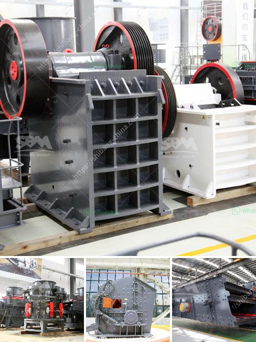

<h3>portable coal cone crusher for hire angola</h3>
The mining industry is unpredictable, cumbersome, and risky. Often, mining operations have to face unexpected challenges, such as harsh weather conditions or limited access to resources. In such cases, having the right equipment becomes crucial for the smooth operation of the mine. One such equipment that has gained immense popularity in recent times is the portable coal cone crusher.

A portable coal cone crusher is a versatile equipment that can be used to crush coal and other similar materials. It consists of a cone-shaped crushing chamber, a set of heavy-duty vibrating grates, and an electric motor. It is designed to provide powerful crushing performance while reducing operational costs.

1. Versatility: The portable coal cone crusher is not limited to a specific type of mine or operation. It can be easily transported and set up anywhere, making it ideal for small to medium-sized mining operations or temporary mining sites. This versatility allows mine operators to easily shift their operations and crush coal at different sites, reducing downtime and increasing productivity.

2. Accessibility: In remote locations or sites with limited infrastructure, accessing coal reserves can be a daunting task. However, with a portable coal cone crusher, this challenge can be overcome. The equipment can be easily transported to the mining site, reducing the need for expensive infrastructure development. This accessibility enables miners to extract coal from some of the most remote and difficult-to-reach locations.

3. Cost-efficient: Portable coal cone crushers operate on electricity, reducing the reliance on expensive fuels such as diesel. This results in lower operational costs and increased profitability for mining companies. Additionally, the efficient crushing mechanism ensures minimal energy wastage, making it an environmentally friendly option.

4. Enhanced safety: Safety is a top priority in the mining industry. Portable coal cone crushers are equipped with advanced safety features such as non-slip flooring, emergency stop buttons, and conveyor belt protection systems. These safety measures reduce the risk of accidents and injuries, ensuring the well-being of the mine workers.

5. High crushing capacity: Compact in size but mighty in performance, portable coal cone crushers have the ability to crush large quantities of coal in a short span of time. The powerful crushing mechanism allows for quick and efficient processing of coal, resulting in increased productivity and faster turnaround times.

The introduction of portable coal cone crushers has been a game changer for the mining industry. It has revolutionized the way coal is extracted, making mining operations more efficient and cost-effective. With its versatility and accessibility, it has opened up new possibilities for mining companies to tap into previously inaccessible coal reserves. Additionally, the safety features and high crushing capacity of these crushers have improved the overall safety and productivity of mining operations. Overall, the portable coal cone crusher has become an essential equipment in every miner's arsenal, enhancing their ability to conquer the challenges of the mining industry.
<h3>Contact us</h3><ul><li><strong>Whatsapp:&nbsp;<a href="https://wa.me/8613661969651">+8613661969651</a></strong></li><li><a href="https://swt.shibang-china.com/?git&amp;zhl&amp;portable coal cone crusher for hire angola"><strong>Online Service(chat now)</strong></a></li></ul><h3>Related</h3><ul><li><a href='smallest cement plant.md'>smallest cement plant</a></li><li><a href='granite rocks quarry company iyuku edo state.md'>granite rocks quarry company iyuku edo state</a></li><li><a href='small rock crusher machine for sale.md'>small rock crusher machine for sale</a></li><li><a href='jaw crusher machine in saudi.md'>jaw crusher machine in saudi</a></li><li><a href='cost for starting a granite manufacturing.md'>cost for starting a granite manufacturing</a></li></ul>