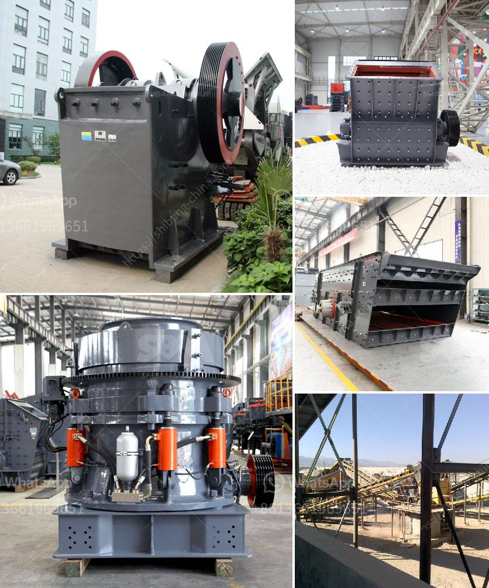

<h3>portable conveyor belts for sale</h3>
In today's fast-paced industrial world, time and efficiency are critical factors in any business operation. Whether it is in a construction site, mining industry, or warehouse, transporting materials from one place to another requires effective systems. Portable conveyor belts have emerged as essential equipment that provides easy transportation and efficient handling of various goods.

Portable conveyor belts are lightweight and flexible systems that can be easily moved, assembled, and disassembled as per the requirements of the task at hand. With their compact design and sturdy construction, these belts offer great versatility, making them suitable for a wide range of applications.

One significant advantage of portable conveyor belts is their ability to navigate through challenging terrains and confined spaces. Traditional conveyor systems often face limitations in terms of maneuverability and flexibility. They may require extensive modifications or even be unsuitable for certain sites. However, portable conveyor belts can be easily adjusted to fit any project, accommodating obstacles and uneven terrains without compromising on efficiency.

For construction sites, these portable belts prove invaluable in moving materials such as sand, gravel, cement, and concrete from one location to another. The flexibility and mobility of these systems enable construction workers to efficiently transport heavy materials, eliminating the need for manual labor and reducing the risk of injuries.

In the mining industry, where the movement of large amounts of ores, coal, and other minerals is required, portable conveyor belts offer a reliable solution. They can be quickly set up to transport materials over long distances, facilitating efficient mining operations. These belts are designed to handle heavy loads, ensuring a smooth and continuous flow of materials, increasing overall productivity.

Warehouses and distribution centers greatly benefit from portable conveyor belts. They streamline the packing and shipping processes, reducing the need for manual labor and minimizing the risk of errors. These belts can be easily installed to transport goods from one point to another, allowing for faster and more efficient handling of inventory.

Portable conveyor belts also contribute to a safer working environment. By automating material transport, workers can avoid physically demanding tasks that can lead to fatigue and injuries. The risk of accidents and tripping hazards is significantly reduced, resulting in a safer and more productive work environment.

Choosing the right portable conveyor belt for your specific requirements is crucial to ensure optimal performance. Factors such as belt width, length, and load capacity need to be considered. Various options such as incline or decline capabilities, adjustable height, and safety features should also be evaluated.

When looking for portable conveyor belts for sale, it is essential to source from reputable manufacturers or suppliers who offer reliable and durable products. Consider factors such as warranty, after-sales service, and customer support to ensure you are investing in a high-quality and dependable system.

In conclusion, portable conveyor belts have revolutionized material handling in various industries. Their ability to provide easy transportation and efficient handling of goods has made them indispensable in today's fast-paced business landscape. With their mobility, versatility, and safety features, these systems offer a seamless solution for any project or operation. Investing in portable conveyor belts is a smart choice for businesses looking to enhance their productivity, reduce manual labor, and create a safer work environment.
<h3>Contact us</h3><ul><li><strong>Whatsapp:&nbsp;<a href="https://wa.me/8613661969651">+8613661969651</a></strong></li><li><a href="https://swt.shibang-china.com/?git&amp;zhl&amp;portable conveyor belts for sale"><strong>Online Service(chat now)</strong></a></li></ul><h3>Related</h3><ul><li><a href='micro powder mill cost.md'>micro powder mill cost</a></li><li><a href='cost of setting a sand crushing plant in india.md'>cost of setting a sand crushing plant in india</a></li><li><a href='basalt manufacturing plant.md'>basalt manufacturing plant</a></li><li><a href='products pe jaw crusher.md'>products pe jaw crusher</a></li><li><a href='vertical vertical roller mill.md'>vertical vertical roller mill</a></li></ul>