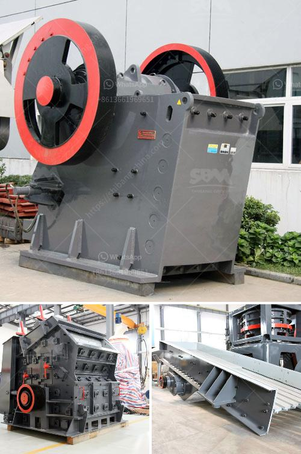

<h3>portable crushing and screening</h3>
When it comes to construction projects or mining operations, one of the primary challenges is managing heavy materials, especially at remote locations. Traditional crushing and screening methods often require significant transportation and logistical arrangements, which can be both time-consuming and costly.

However, with the advent of portable crushing and screening equipment, these challenges can be effectively addressed. Portable crushers and screens are designed to be easily transported from site to site, allowing operators to quickly set up and dismantle the machinery as needed. This mobility not only ensures greater efficiency but also reduces the overall environmental impact.

Portable crushing and screening equipment offers several advantages over stationary machines. Firstly, it eliminates the need for multiple machines and reduces the amount of equipment required on-site. This saves both space and cost. Additionally, portable machines have improved accessibility, making maintenance and repairs much easier.

Another significant advantage of portable crushing and screening equipment is its ability to adapt to various job sites. Whether it's a construction site, demolition project, or mining operation, these machines can be rapidly adjusted to meet different material requirements. This versatility ensures that operators can tackle diverse projects with ease.

Furthermore, portable crushing and screening equipment offers enhanced productivity. Operators can process materials directly at the job site, eliminating the need for additional transport and reducing downtime. By crushing and screening materials on-site, contractors can save time and money while also improving overall project efficiency.

Lastly, the portability of this equipment allows for greater flexibility in project planning and execution. Operators can quickly respond to changes in demand or unexpected requirements, ensuring that projects stay on schedule. This adaptability is particularly valuable in remote locations where accessing additional equipment may be challenging.

In conclusion, portable crushing and screening equipment is a convenient and efficient solution for various construction and mining projects. The ability to transport and set up these machines quickly enables operators to save time, money, and resources. With improved accessibility, adaptability, and productivity, portable crushing and screening equipment is revolutionizing the industry and empowering operators to take on new challenges with confidence.
<h3>Contact us</h3><ul><li><strong>Whatsapp:&nbsp;<a href="https://wa.me/8613661969651">+8613661969651</a></strong></li><li><a href="https://swt.shibang-china.com/?git&amp;zhl&amp;portable crushing and screening"><strong>Online Service(chat now)</strong></a></li></ul><h3>Related</h3><ul><li><a href='nigeria cone crusher photos.md'>nigeria cone crusher photos</a></li><li><a href='portable gold recovery mill for sale.md'>portable gold recovery mill for sale</a></li><li><a href='fine grinding mills.md'>fine grinding mills</a></li><li><a href='saudi arabia used conveyor belts price.md'>saudi arabia used conveyor belts price</a></li><li><a href='mobile cone crusher plant.md'>mobile cone crusher plant</a></li></ul>