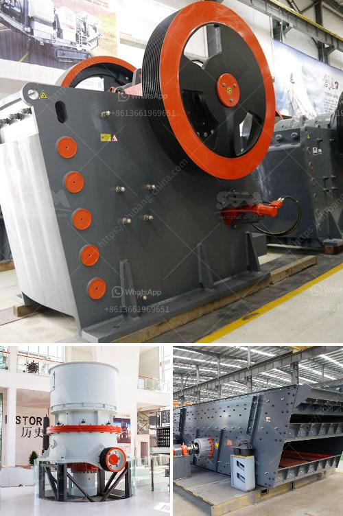

<h3>portable crushing</h3>
In industries such as construction, mining, and demolition, the ability to quickly and efficiently process materials is crucial for meeting project deadlines and minimizing costs. This is where portable crushing equipment comes into play. Portable crushers, also known as mobile crushers, are heavy machinery designed to break large rocks into smaller sizes and convert them into usable aggregates for various applications.

One of the main advantages of portable crushing equipment is its ability to be transported and set up quickly and easily at different job sites. Unlike stationary crushers, which require extensive preparation and infrastructure, portable crushers can be brought to the site and operational within minutes, saving valuable time and reducing logistical complexities. This allows contractors to move from one project to another seamlessly, enhancing productivity and maximizing project efficiency.

Another significant benefit of portable crushing equipment is its versatility. These machines can process a wide range of materials, including concrete, asphalt, rock, and gravel, providing the necessary flexibility to adapt to different projects and satisfy varying material requirements. Whether the goal is to produce aggregate for road construction or create fill materials for landscaping projects, portable crushers can handle it all.

Moreover, portable crushing equipment is equipped with advanced features that facilitate efficient material processing. Many models incorporate hydraulic systems for quick adjustment of settings, ensuring optimal crushing performance for different types of materials. This precision and control result in high-quality end products that meet the required specifications. Additionally, these machines are designed with safety features to protect operators on-site, promoting a secure working environment.

Cost reduction is yet another advantage of portable crushing equipment. By eliminating the need to transport materials to off-site crushing plants, contractors can significantly reduce transportation costs and environmental impact. This not only preserves natural resources but also minimizes carbon emissions associated with vehicular movement. Additionally, on-site material processing eliminates the need for purchasing aggregates, reducing project expenses.

Overall, portable crushing equipment offers numerous benefits for industries that require on-site material processing. Its mobility, versatility, efficiency, and cost-effectiveness make it an invaluable asset in the modern construction and mining sector. With advances in technology, the available range of portable crushers continues to expand, making it an even more attractive solution for contractors seeking convenience and productivity in their operations.
<h3>Contact us</h3><ul><li><strong>Whatsapp:&nbsp;<a href="https://wa.me/8613661969651">+8613661969651</a></strong></li><li><a href="https://swt.shibang-china.com/?git&amp;zhl&amp;portable crushing"><strong>Online Service(chat now)</strong></a></li></ul><h3>Related</h3><ul><li><a href='concrete mobile crusher for rent in usa.md'>concrete mobile crusher for rent in usa</a></li><li><a href='manufacturer of ball mill india.md'>manufacturer of ball mill india</a></li><li><a href='gold crushers sale.md'>gold crushers sale</a></li><li><a href='rencana bisnis perusahaan tambang pdf.md'>rencana bisnis perusahaan tambang pdf</a></li><li><a href='small mobile stone crushers.md'>small mobile stone crushers</a></li></ul>