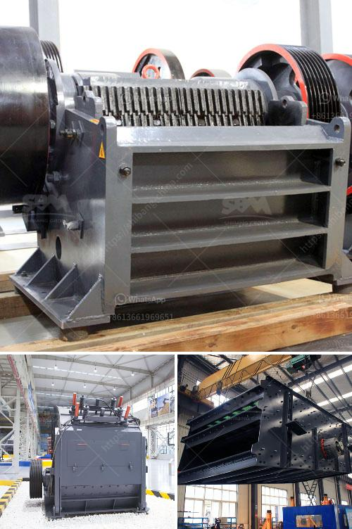

<h3>portable cyanide plant gold processing with prices</h3>
Gold has long been a desirable and valuable resource, and its mining and processing methods have continued to evolve over the years. One of the prominent techniques employed is cyanide leaching, which offers a cost-effective way to extract gold from various sources. This article aims to shed light on the concept of portable cyanide plant gold processing and discuss the associated prices.

Portable cyanide plant gold processing is a compact and flexible method designed to efficiently extract gold from low-grade ores and tailings. Portable plants are equipped with different modules, such as crushing, grinding, and gravity separation. Cyanide leaching, the core process of portable cyanide plant gold processing, breaks down the gold ore into smaller particles, making it accessible for further gold recovery methods.

1. Accessibility and mobility: Portable cyanide plants can be easily transported to different sites, making them suitable for processing gold in remote areas or on a smaller scale. This mobility also allows miners to move operations closer to the source of gold, reducing transport costs and associated risks.

2. Customizability: Portable cyanide plants can be tailored to meet the specific needs of individual miners or mining companies. Modules can be adapted or combined based on the ore characteristics and desired gold recovery rates, allowing for greater flexibility and efficiency.

3. Efficient gold recovery: Once the gold ore is crushed and ground, cyanide leaching is employed to separate the gold from other minerals. Cyanide forms a complex with gold ions, promoting its dissolution. The leach solution is then processed through various techniques, such as carbon adsorption or precipitation, to recover the gold.

The prices associated with portable cyanide plant gold processing can vary depending on several factors, including the following:

1. Size and capacity: Larger portable plants capable of processing higher volumes of ore will generally come with higher price tags due to their increased complexity and capabilities.

2. Grade of ore: The gold content of the ore being processed can impact the cost. Higher-grade ores require fewer processing steps and lower amounts of reagents such as cyanide, reducing costs.

3. Desired gold recovery rates: Some gold processing operations may require higher recovery rates, necessitating additional processing modules or specialized equipment, which could affect the final price.

It is essential to recognize that the capital investment in a portable cyanide plant gold processing system can yield considerable returns in the long run. Maximizing gold recovery while minimizing operational costs are crucial aspects to consider when evaluating the price of such systems.

Portable cyanide plant gold processing is an effective and efficient method for extracting gold from low-grade ores and tailings. Its accessibility, customizability, and efficient gold recovery techniques make it an attractive option for miners operating in remote areas or looking for more flexible processing solutions. While prices may vary depending on factors such as size, capacity, ore grade, and desired recovery rates, the investment in a portable cyanide plant gold processing system can ultimately lead to valuable returns for miners.
<h3>Contact us</h3><ul><li><strong>Whatsapp:&nbsp;<a href="https://wa.me/8613661969651">+8613661969651</a></strong></li><li><a href="https://swt.shibang-china.com/?git&amp;zhl&amp;portable cyanide plant gold processing with prices"><strong>Online Service(chat now)</strong></a></li></ul><h3>Related</h3><ul><li><a href='mobile crusher in saudi arabia.md'>mobile crusher in saudi arabia</a></li><li><a href='concrete waste crushing and iron.md'>concrete waste crushing and iron</a></li><li><a href='stone crusher mills in mercadolibre.md'>stone crusher mills in mercadolibre</a></li><li><a href='aggregate equipment for sale.md'>aggregate equipment for sale</a></li><li><a href='small mobile stone crushers.md'>small mobile stone crushers</a></li></ul>