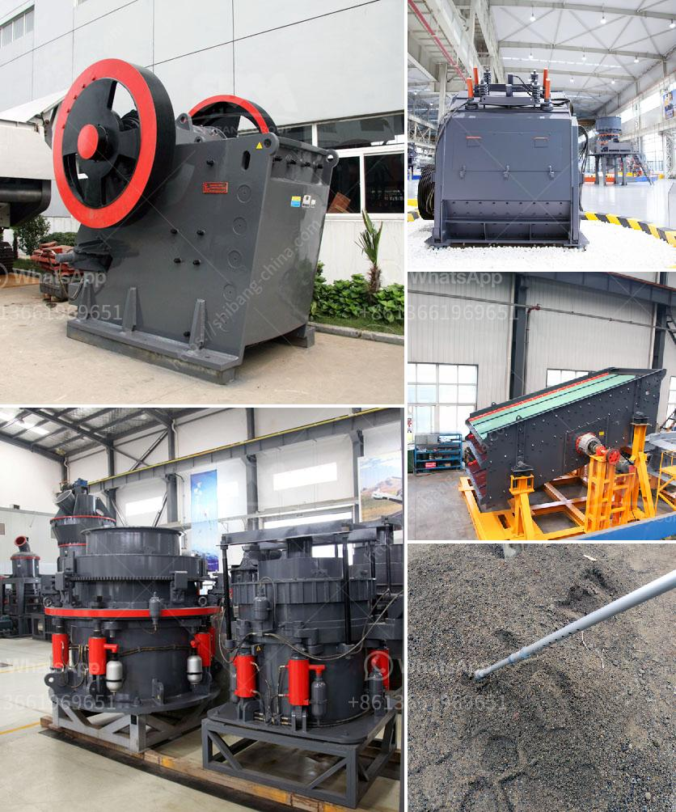

<h3>portable gold mining plant pdf</h3>
The gold mining industry has long been a crucial sector driving economic growth and development across the globe. With advancements in technology, portable gold mining plants in PDF format have emerged as a game-changing solution for miners. This article aims to shed light on the advantages offered by these innovative portable plants.

Portable gold mining plants in PDF format are designed to be easily transported from one site to another. This mobility factor enables miners to swiftly move their operations and set up mining activities in different regions with ease. As a result, the efficiency of gold mining processes is greatly enhanced, as operations can be rapidly initiated or relocated to areas with higher yield prospects.

The compact nature of portable gold mining plants ultimately lowers the cost of operations. Traditional mining plants require significant investments in infrastructure, such as power lines, roads, and permanent facilities. However, with portable plants, most of this infrastructure is eliminated, significantly reducing upfront capital costs and ongoing expenses, thereby enhancing the profitability of gold mining operations.

Another crucial advantage of portable gold mining plants is their environmentally friendly design. These plants incorporate advanced technologies that minimize negative environmental impacts while maximizing gold recovery rates. Additionally, their compact nature minimizes the land area required for mining activities, reducing habitat disruption and land degradation risks.

Portable gold mining plants enhance safety measures for miners by incorporating modern safety features. With reduced machinery and dependence on heavy equipment, the risk of accidents and injuries is minimized. The accessibility of these portable plants also ensures that mining activities can be conducted in remote and challenging terrains, providing equal opportunities for small-scale miners to participate profitably.

Portable gold mining plants in PDF format offer a myriad of benefits for the gold mining industry. Their efficiency, affordability, sustainability, and safety advantages make them a compelling choice for both large-scale mining operations and small-scale mining endeavors. As the gold mining sector continues to evolve, portable plants are emerging as a prominent solution, revolutionizing the industry and unlocking new possibilities for gold extraction.
<h3>Contact us</h3><ul><li><strong>Whatsapp:&nbsp;<a href="https://wa.me/8613661969651">+8613661969651</a></strong></li><li><a href="https://swt.shibang-china.com/?git&amp;zhl&amp;portable gold mining plant pdf"><strong>Online Service(chat now)</strong></a></li></ul><h3>Related</h3><ul><li><a href='how to calculate coal mill capacity for cement plant.md'>how to calculate coal mill capacity for cement plant</a></li><li><a href='coal grinding mill.md'>coal grinding mill</a></li><li><a href='used crusher mobile for sale in uae.md'>used crusher mobile for sale in uae</a></li><li><a href='industrial grinder fine powder.md'>industrial grinder fine powder</a></li><li><a href='cost of glass aggregate machines.md'>cost of glass aggregate machines</a></li></ul>