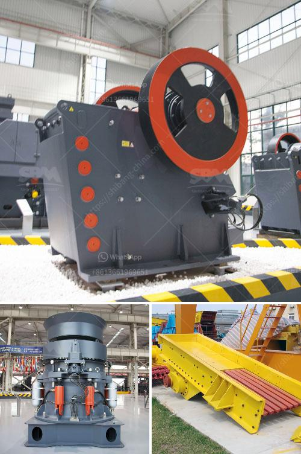

<h3>portable gold recovery mill for sale</h3>
Gold mining is a lucrative industry in many countries and investing in gold recovery mills can be highly profitable. Portable mills are a cost-effective option for small-scale miners and individuals looking for potential investment opportunities. These mills can be easily transported to remote areas and set up in a short amount of time, making them ideal for gold recovery operations in hard-to-reach locations.

A portable gold recovery mill is a specialized piece of equipment specifically designed to crush, grind, and separate gold from other minerals. This process is accomplished using a combination of physical and chemical operations. The mill first crushes the rock containing gold, then grinds it to a fine powder. The powdered material is then subjected to various chemical processes to separate the gold from other minerals.

The primary advantage of a portable gold recovery mill is its mobility. It can be easily transported to different locations, allowing miners to take advantage of promising gold deposits in remote areas. Traditional gold recovery mills are typically large and stationary, requiring significant investment in infrastructure and transportation. In contrast, portable mills are compact and lightweight, making them easier and cheaper to transport.

Setting up a portable mill is also relatively simple. It can be assembled quickly and does not require complex infrastructure or extensive training. This makes it an excellent choice for small-scale miners or individuals looking to invest in gold recovery. The portability of these mills enables miners to move from one location to another as they exhaust gold deposits, maximizing their potential profit.

Another advantage of portable gold recovery mills is their lower operating costs. Portable mills are usually powered by diesel generators, which are more cost-effective and readily available in remote areas compared to grid electricity. Additionally, portable mills require less water, making them suitable for areas with limited water resources. The lower operating costs of portable mills can significantly increase the profitability of gold recovery operations.

In recent years, there has been an increasing demand for portable gold recovery mills in various parts of the world. As the price of gold continues to rise, more individuals are turning to gold mining as an investment opportunity. Portable mills provide accessibility to gold deposits previously inaccessible due to their remote location or lack of infrastructure. This, in turn, expands the potential market for gold recovery mills.

When looking for a portable gold recovery mill for sale, it is essential to consider factors such as reliability, durability, and efficiency. The mill should be capable of extracting the maximum amount of gold from the raw material efficiently. It is also important to consider factors such as safety features, ease of operation, and maintenance requirements.

In conclusion, a portable gold recovery mill is a smart investment for individuals and small-scale miners interested in profiting from gold mining. These mills offer the flexibility and mobility necessary to exploit gold deposits in remote areas effectively. As prices continue to rise, gold recovery mills provide an opportunity to turn raw materials into valuable assets.
<h3>Contact us</h3><ul><li><strong>Whatsapp:&nbsp;<a href="https://wa.me/8613661969651">+8613661969651</a></strong></li><li><a href="https://swt.shibang-china.com/?git&amp;zhl&amp;portable gold recovery mill for sale"><strong>Online Service(chat now)</strong></a></li></ul><h3>Related</h3><ul><li><a href='specification jaw crusher.md'>specification jaw crusher</a></li><li><a href='feldspar grinding plant.md'>feldspar grinding plant</a></li><li><a href='how much is gold hammer mill crusher.md'>how much is gold hammer mill crusher</a></li><li><a href='mtm raymond mill.md'>mtm raymond mill</a></li><li><a href='application procedure for ball mill.md'>application procedure for ball mill</a></li></ul>