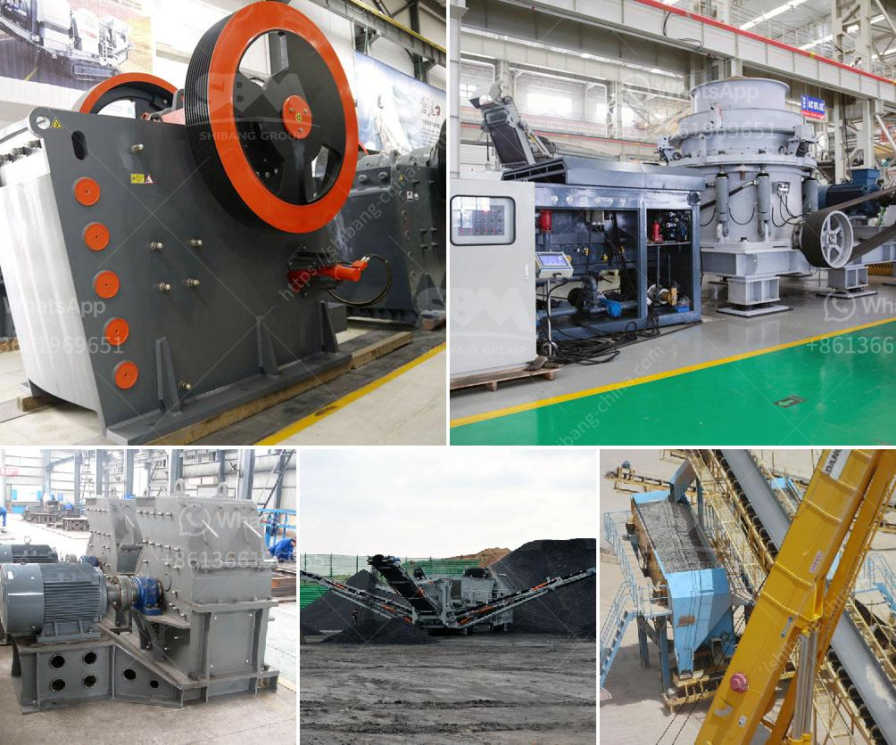

<h3>portable gold wash plant for sale usa</h3>
Gold mining is a lucrative industry. As such, many individuals and companies are actively seeking opportunities to invest in gold mining operations. One essential piece of equipment that every gold miner needs is a high-quality portable gold wash plant. These machines efficiently separate gold particles from dirt and other materials, allowing miners to extract the precious metal more easily. In the USA, there are several options available for purchasing portable gold wash plants, offering a range of features and prices to suit different needs.

A portable gold wash plant is a compact and highly efficient machine that is designed to efficiently remove gold from gravel and dirt using water and mechanical methods. This portable gold wash plant is ideally suited for small-scale gold mining operations where finding and recovering gold quickly is crucial. The plant consists of a vibrating hopper, a grizzly screen, sluice boxes, and a generator. It can process up to 200 cubic yards of material per hour, making it an ideal choice for most small-scale gold mining operations in the USA.

One popular option for purchasing portable gold wash plants in the USA is purchasing them from reputable manufacturers or suppliers. These manufacturers often have a wide range of models available to choose from, each with different features and capacities. Some of these models are specifically designed for the US market and comply with all relevant safety standards and regulations. Additionally, purchasing from a reputable manufacturer ensures that the portable gold wash plant will be of good quality and come with a warranty.

Another option for purchasing portable gold wash plants in the USA is through online marketplaces and auctions. These platforms often have a wide variety of new and used portable gold wash plants available for sale. Buyers can browse through different listings to find the perfect plant for their specific needs and budget. However, it is important for buyers to exercise caution when purchasing from online sources and ensure that the seller is reputable. Conducting thorough research, reading reviews, and asking for referrals can help buyers make a more informed decision.

One primary advantage of purchasing a portable gold wash plant in the USA is the ability to transport it easily to different mining sites. These plants are designed to be compact and lightweight, making them easier to maneuver and transport between locations. In addition, they can be set up and operational within a short period, minimizing downtime and maximizing productivity.

When purchasing a portable gold wash plant in the USA, there are a few key factors to consider. First, buyers should determine the desired capacity of the plant and ensure that it can meet their production requirements. Second, they should consider the power source of the plant and whether it meets their specific needs. Some plants are powered by generators, whereas others can be plugged into an electrical supply. Finally, buyers should consider the overall quality, durability, and reputation of the manufacturer or seller to ensure they are purchasing a reliable machine.

In conclusion, a portable gold wash plant is an essential piece of equipment for gold miners in the USA. Whether purchased from a reputable manufacturer or through an online marketplace, these machines allow miners to efficiently separate gold from gravel and dirt, making the extraction process easier and more profitable. By considering factors such as capacity, power source, and overall quality, gold miners can find the ideal portable gold wash plant to meet their specific needs.
<h3>Contact us</h3><ul><li><strong>Whatsapp:&nbsp;<a href="https://wa.me/8613661969651">+8613661969651</a></strong></li><li><a href="https://swt.shibang-china.com/?git&amp;zhl&amp;portable gold wash plant for sale usa"><strong>Online Service(chat now)</strong></a></li></ul><h3>Related</h3><ul><li><a href='crush stone machinery.md'>crush stone machinery</a></li><li><a href='iron crushing plant in mexico.md'>iron crushing plant in mexico</a></li><li><a href='m sand crusher in tirunelveli.md'>m sand crusher in tirunelveli</a></li><li><a href='granite crusher technology.md'>granite crusher technology</a></li><li><a href='buy fully gold mining wash plant.md'>buy fully gold mining wash plant</a></li></ul>