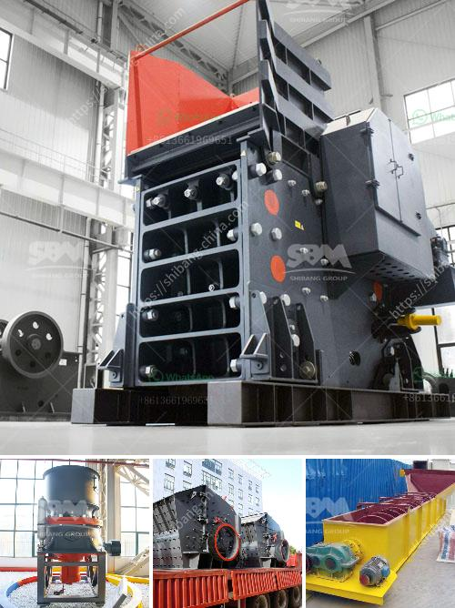

<h3>portable gold wash plant for sale</h3>
Gold mining can be a lucrative endeavor, but it often requires significant investments in expensive equipment. However, portable gold wash plants can offer a cost-efficient and practical alternative to traditional gold mining methods.

A portable gold wash plant is a compact and mobile machine that is designed to efficiently wash gold-bearing materials, such as placer deposits or alluvial gold. These advanced and highly versatile plants are well-suited for mining operations where extracting gold from high-grade deposits is not feasible using traditional mining methods.

One of the main advantages of a portable gold wash plant is its mobility. These plants can be easily transported to any location, allowing miners to access remote sites potentially rich in gold deposits. By eliminating the need for extensive infrastructure development, such as building roads or installing power lines, portable gold wash plants significantly reduce operational costs and time.

Another key benefit of portable gold wash plants is their high adaptability and versatility. They come in various sizes and configurations, allowing miners to select the most suitable plant for their specific requirements. Most portable wash plants feature integrated screens and sluice boxes, which effectively separate and capture gold particles from other materials, such as rocks and sand. These plants can process a wide range of feed material, including clayey soils or sticky alluvial deposits, ensuring efficient gold recovery in diverse mining conditions.

Furthermore, many portable gold wash plants are designed to be environmentally friendly. They employ innovative technologies that minimize water usage, making them ideal for regions facing water scarcity or regulatory restrictions on water usage. These eco-friendly plants also mitigate the impact on local ecosystems by reducing sedimentation and preventing the discharge of harmful chemicals or pollutants into nearby water bodies.

When searching for a portable gold wash plant for sale, there are several factors to consider. First and foremost, the plant should be able to handle the expected feed capacity, which determines the amount of material it can process within a specific period. Additionally, the wash plant's recovery efficiency is a crucial aspect to consider. A high recovery rate ensures that a significant amount of gold can be extracted from the processed material, maximizing the profit potential of the operation.

Other factors to consider include ease of operation and maintenance, as well as the availability of spare parts and technical support. It is important to choose a reputable manufacturer or supplier that offers a warranty, as it provides peace of mind knowing that any potential issues will be promptly addressed.

In conclusion, a portable gold wash plant offers a cost-efficient and practical solution for gold mining. Its mobility, adaptability, and eco-friendly features make it an attractive option for miners seeking to extract gold in remote locations or environmentally sensitive areas. By minimizing infrastructure requirements and employing advanced technologies, portable gold wash plants streamline the gold recovery process, saving time, and reducing costs. With careful research and consideration, miners can find a high-quality portable gold wash plant for sale that meets their specific needs and maximizes their success in the gold mining industry.
<h3>Contact us</h3><ul><li><strong>Whatsapp:&nbsp;<a href="https://wa.me/8613661969651">+8613661969651</a></strong></li><li><a href="https://swt.shibang-china.com/?git&amp;zhl&amp;portable gold wash plant for sale"><strong>Online Service(chat now)</strong></a></li></ul><h3>Related</h3><ul><li><a href='calcium carbonate grinding plant feasibility.md'>calcium carbonate grinding plant feasibility</a></li><li><a href='desain gambar vibrating screen 100ton jam.md'>desain gambar vibrating screen 100ton jam</a></li><li><a href='mineral pulverising ball mill manufacturer in india.md'>mineral pulverising ball mill manufacturer in india</a></li><li><a href='iron ore beneficiation plants price in china.md'>iron ore beneficiation plants price in china</a></li><li><a href='concrete waste crushing and iron.md'>concrete waste crushing and iron</a></li></ul>