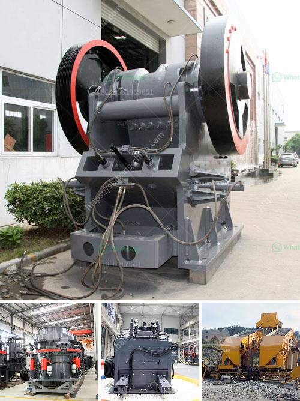

<h3>portable quarry crushers for sale in the usa</h3>
Quarrying operations are an essential part of the construction industry. They provide the raw materials needed for various projects, including roads, bridges, buildings, and more. To extract these important resources, quarrying companies rely heavily on heavy machinery, such as crushers, to break down large rocks into smaller, more manageable sizes. In recent years, portable quarry crushers have gained significant popularity in the USA due to their numerous benefits and versatility.

Portable quarry crushers are mobile units that are designed to crush rocks and other materials on-site, reducing the need for transportation and ensuring a steady supply of materials for construction projects. These crushers are highly efficient and can be easily moved from one location to another. This flexibility allows quarrying companies to quickly respond to changing demands and access remote areas where traditional crushers may not be practical.

One of the key advantages of portable quarry crushers is their ability to crush a variety of materials, including limestone, granite, and even concrete. This versatility makes them suitable for a wide range of applications, from road construction to building foundations. Additionally, these crushers can be equipped with various attachments and screening systems, allowing operators to produce different sizes of crushed materials with ease.

Another significant benefit of portable quarry crushers is their cost-effectiveness. These crushers eliminate the need for expensive transportation of materials, as they can be directly crushed on-site. Moreover, they require less manpower compared to traditional crushers, resulting in reduced labor costs. Additionally, portable crushers are more fuel-efficient, reducing operational expenses and contributing to a greener environment.

Furthermore, the operational safety of portable quarry crushers is a top priority. These machines are equipped with advanced safety features and control systems, ensuring operator safety and minimizing the risk of accidents. Additionally, their compact design and ease of operation make them user-friendly, allowing operators of all skill levels to use them effectively.

In the USA, the market for portable quarry crushers has been steadily growing in recent years. With an increasing focus on infrastructure development, there is a higher demand for construction materials, driving the need for efficient crushing solutions. The portability and versatility of these crushers make them an attractive choice for quarrying companies, allowing them to optimize their operations and meet the growing demands of the industry.

In conclusion, portable quarry crushers have revolutionized the quarrying industry in the USA. Their ability to crush a variety of materials, cost-effectiveness, and operational safety make them an indispensable tool for quarrying operations. As the construction industry continues to grow, the demand for portable quarry crushers is expected to rise. With their numerous benefits and versatility, these crushers are set to play a crucial role in the USA's construction and infrastructure development.
<h3>Contact us</h3><ul><li><strong>Whatsapp:&nbsp;<a href="https://wa.me/8613661969651">+8613661969651</a></strong></li><li><a href="https://swt.shibang-china.com/?git&amp;zhl&amp;portable quarry crushers for sale in the usa"><strong>Online Service(chat now)</strong></a></li></ul><h3>Related</h3><ul><li><a href='quarry machines from germany.md'>quarry machines from germany</a></li><li><a href='cone crusher device.md'>cone crusher device</a></li><li><a href='capacity of the ball mill and rod mill.md'>capacity of the ball mill and rod mill</a></li><li><a href='raymond gypsum mill in india.md'>raymond gypsum mill in india</a></li><li><a href='ton hour coal crusher and screen.md'>ton hour coal crusher and screen</a></li></ul>