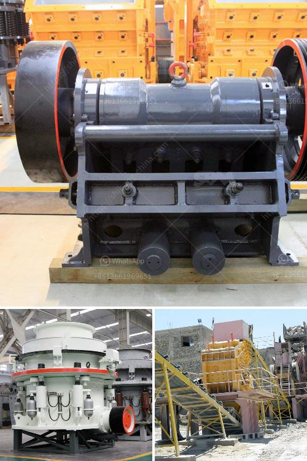

<h3>portable sand washing machine</h3>
Keeping our surroundings and belongings clean has become a priority for many individuals, whether it’s at home or while traveling. One of the essential aspects of maintaining cleanliness is ensuring that our clothes and other fabrics are free from dirt and stains. This is where a portable sand washing machine comes into play.

A portable sand washing machine is a compact and convenient appliance designed to wash light, delicate, or heavily soiled clothes in a quick and efficient manner. Its small size and lightweight nature make it ideal for those who are constantly on the go, such as travelers, campers, and students living in dormitories.

The portable sand washing machine operates on the principle of agitation, which helps to remove dirt, stains, and odors from fabric. It usually consists of a compact drum where the clothes are placed along with water and detergent. The machine then agitates the clothes, mimicking the action of hand-washing, to thoroughly remove dirt particles. The dirty water is then drained out, leaving behind clean and fresh clothes.

What sets the portable sand washing machine apart from traditional washing machines is its flexibility and convenience. Most portable machines do not require a permanent water connection, as they can be easily filled with water from any source, such as a sink or a bucket. They also typically have different wash cycles and timers to suit various fabric types and degrees of soiling.

In addition to being portable and user-friendly, these machines are also energy-efficient. They consume less water and electricity compared to conventional washers, making them environmentally friendly and cost-effective in the long run.

Whether you are living in a compact apartment or spending your days exploring the great outdoors, a portable sand washing machine is a valuable tool to have. Its compact design, ease of use, and efficient cleaning action make it an indispensable companion for maintaining cleanliness and ensuring fresh and stain-free clothes. So next time you’re contemplating how to wash your clothes on the go, consider investing in a portable sand washing machine for a hassle-free experience.
<h3>Contact us</h3><ul><li><strong>Whatsapp:&nbsp;<a href="https://wa.me/8613661969651">+8613661969651</a></strong></li><li><a href="https://swt.shibang-china.com/?git&amp;zhl&amp;portable sand washing machine"><strong>Online Service(chat now)</strong></a></li></ul><h3>Related</h3><ul><li><a href='price of quarry crusher machines.md'>price of quarry crusher machines</a></li><li><a href='gold mobile crushing equipment.md'>gold mobile crushing equipment</a></li><li><a href='gold mining production line or gold mining plant.md'>gold mining production line or gold mining plant</a></li><li><a href='small ball mill for cement clinker grinding india.md'>small ball mill for cement clinker grinding india</a></li><li><a href='small ball mill price.md'>small ball mill price</a></li></ul>