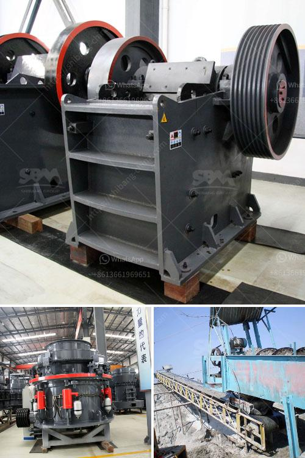

<h3>portable stone crusher philippines</h3>
Portable stone crusher in the Philippines is widely used in mining, construction, and recycling projects. The main advantage of this equipment is that it can be moved to any location and can be used in scattered areas. This not only saves the transportation cost but also avoids the problem of infrastructure construction, reducing the pollution caused by construction waste.

The portable stone crusher is equipped with some wheels, which makes it easy to move. It can be dragged by tractors and pulled to the construction site easily. The integrated unit installation form reduces the workload of installation and erection of split components, which not only saves the cost but also reduces the working time.

The portable stone crusher is mainly operated by electric power. It can produce various types of broken stone, such as granite, limestone, basalt, river pebble, quartz stone, iron ore, etc.. The product size is can be adjusted between 0-20mm. This small portable stone crusher has the advantages of small footprint, less investment, and convenient movement. It is widely used in mining, construction, road construction, and building construction.

Due to its excellent performance and unique characteristics, the portable stone crusher is widely used in various crushing and screening processes. For example, it can be used for crushing and screening of construction waste, mine ore, sandstone, granite, limestone, etc.; it can also be used for separation and screening of river pebble and construction waste. Different types of portable stone crushers can be operated as independent units or as a two- or three-stage crushing application:

1. Primary crushing: Jaw crusher, impact crusher, or gyratory crushers are usually used for primary reduction.

2. Secondary crushing: The crushed material after primary crushing is sent to cone crusher or impact crusher for further crushing.

In summary, portable stone crusher is a good choice for contractors, quarry operators, and construction companies of all sizes. Economically efficient, environmentally friendly, and so on. It brings an incredible benefit to investors. They can have an opportunity to quickly recover their investment while also making a contribution to the environment.
<h3>Contact us</h3><ul><li><strong>Whatsapp:&nbsp;<a href="https://wa.me/8613661969651">+8613661969651</a></strong></li><li><a href="https://swt.shibang-china.com/?git&amp;zhl&amp;portable stone crusher philippines"><strong>Online Service(chat now)</strong></a></li></ul><h3>Related</h3><ul><li><a href='mica grinding mill.md'>mica grinding mill</a></li><li><a href='lime stone crusher section in cement plant pdf.md'>lime stone crusher section in cement plant pdf</a></li><li><a href='jaw crusher for sale in saudi.md'>jaw crusher for sale in saudi</a></li><li><a href='100tph small capacity granite crusher.md'>100tph small capacity granite crusher</a></li><li><a href='concrete crusher kenya.md'>concrete crusher kenya</a></li></ul>