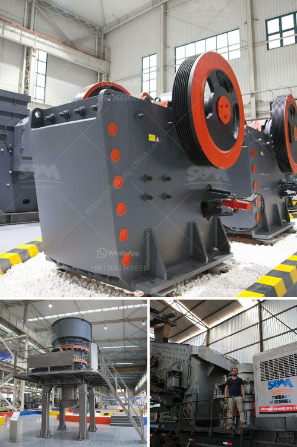

<h3>powder grinding machines philippines</h3>
The Philippines, being a rapidly developing nation, is home to various industries that require the usage of different types of machinery. One such machinery that has gained significant popularity in recent years is powder grinding machines. These machines are widely used in industries like mining, construction, and pharmaceuticals for grinding various materials into fine powder form. Powder grinding machines are generally used to process materials with low or medium hardness, and are capable of grinding materials like limestone, calcite, marble, talc, barite, dolomite, etc.

One of the key benefits of powder grinding machines is their ability to increase productivity and efficiency in various industries. These machines are designed to reduce the size of the materials and turn them into fine powder form, which can be further used in downstream processes. Moreover, powder grinding machines are capable of achieving a wide range of particle sizes, allowing industries to tailor the end product according to their specific requirements.

The Philippines, being rich in mineral resources, has seen a significant rise in the demand for powder grinding machines. These machines have proven to be instrumental in the mining industry, where they are used to grind minerals like limestone and dolomite to produce high-quality cement. Additionally, the construction industry has also witnessed a surge in the usage of powder grinding machines, as they are used to grind materials like barite and calcite for various construction purposes.

Not only do powder grinding machines improve industrial productivity, but they also offer cost-effective solutions for businesses. These machines require relatively low maintenance and are energy-efficient, resulting in reduced operational costs. Furthermore, their compact design allows businesses to save space and optimize floor area, leading to more efficient production processes.

In conclusion, powder grinding machines have become an essential part of various industries in the Philippines. With their ability to increase productivity, reduce costs, and offer a wide range of particle sizes, these machines have proven to be a boon for industrial productivity in the country. As the demand for finely powdered materials continues to rise, the usage of powder grinding machines is likely to witness further growth, thereby propelling the nation's industrial development.
<h3>Contact us</h3><ul><li><strong>Whatsapp:&nbsp;<a href="https://wa.me/8613661969651">+8613661969651</a></strong></li><li><a href="https://swt.shibang-china.com/?git&amp;zhl&amp;powder grinding machines philippines"><strong>Online Service(chat now)</strong></a></li></ul><h3>Related</h3><ul><li><a href='sand crusher machine.md'>sand crusher machine</a></li><li><a href='hot used trommel screen machine in sand.md'>hot used trommel screen machine in sand</a></li><li><a href='uk made stone crushing machine.md'>uk made stone crushing machine</a></li><li><a href='ball mill grinding relation with quality pdf.md'>ball mill grinding relation with quality pdf</a></li><li><a href='latest stone crusher east timor.md'>latest stone crusher east timor</a></li></ul>