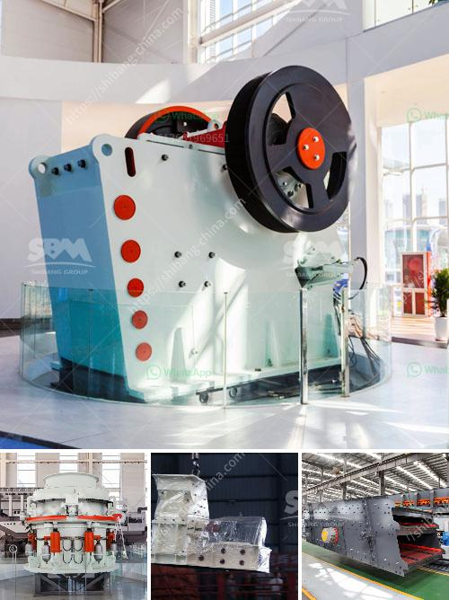

<h3>price 200 crusher price</h3>
In today's fast-paced world, where time is of utmost essence, having efficient and powerful tools has become a necessity. One such indispensable tool is a crusher, commonly used in various industries for reducing the size of different materials. And now, rejoice, as we unveil the incredible Crusher priced at just $200! This pocket-friendly price tag comes with an array of advanced features that make it a value-for-money investment.

Despite its affordable price, the $200 Crusher boasts an impressive range of features that make it stand out from its competitors. Let's delve into some of those features:

1. Uncompromised Power: Equipped with a high-performance motor, the Crusher effortlessly grinds and pulverizes materials, delivering fast and efficient results. Its sturdy construction ensures durability and longevity, allowing for extended and uninterrupted use.

2. Versatile Crushing Options: Whether you need to crush rocks, concrete, or even ice, the Crusher handles it all. Its adjustable settings allow you to customize the crushing process based on your specific needs, ensuring optimal results every time.

3. Compact and Portable Design: The Crusher's compact design makes it easy to transport and store. Whether you're taking it on the go or utilizing it in your workshop, its portability is an added advantage, ensuring convenience and flexibility.

4. Safety Features: The Crusher prioritizes safety with features like an automatic shut-off mechanism, preventing accidents and ensuring peace of mind during usage. It also guarantees minimal noise and vibration, reducing the risk of disturbances or discomfort.

At just $200, the Crusher is a true steal! Its unbeatable price, combined with its powerful features and superior quality, make it a standout product in the market. Similar crushers often come with exorbitant price tags, making them unaffordable for many users. But with the $200 Crusher, you can own a top-notch crusher, without breaking the bank.

Investing in a high-quality crusher need not be a budget-busting affair. With the $200 Crusher's exceptional performance, user-friendly features, and unbeatable price, it is undoubtedly a game-changer in the industry. Delight in its power, versatility, and reliability, knowing that you have made an intelligent choice without compromising on quality nor emptying your wallet. Don't miss out on this incredible opportunity; get your hands on the Crusher today and experience a crushing revolution like never before!
<h3>Contact us</h3><ul><li><strong>Whatsapp:&nbsp;<a href="https://wa.me/8613661969651">+8613661969651</a></strong></li><li><a href="https://swt.shibang-china.com/?git&amp;zhl&amp;price 200 crusher price"><strong>Online Service(chat now)</strong></a></li></ul><h3>Related</h3><ul><li><a href='vertical mill mining.md'>vertical mill mining</a></li><li><a href='jaw crusher ghana quarry plant.md'>jaw crusher ghana quarry plant</a></li><li><a href='mobile stone crusher plant.md'>mobile stone crusher plant</a></li><li><a href='ball mill maintenance seminar.md'>ball mill maintenance seminar</a></li><li><a href='mineral processing ball mills nigeria.md'>mineral processing ball mills nigeria</a></li></ul>