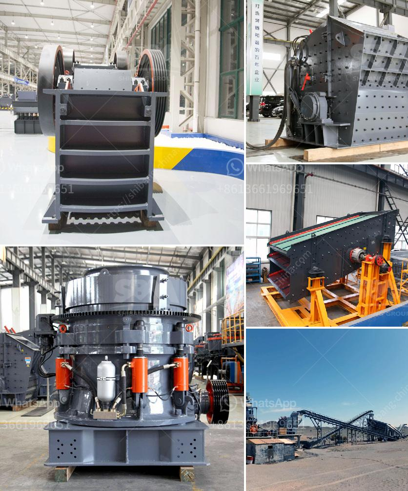

<h3>price conveyor belt price</h3>
When it comes to purchasing a conveyor belt, price is often a key consideration. Conveyor belts are an integral part of various industries, such as manufacturing, mining, food processing, and logistics, as they provide efficient transportation of materials and products. However, the cost of a conveyor belt can vary significantly based on several factors. In this article, we will explore these factors and provide insights to help you make an informed decision.

The material used for the conveyor belt greatly influences its price. Conveyor belts can be constructed from a wide range of materials, including rubber, nylon, polyester, steel, and more. Each material has its own set of advantages and disadvantages, affecting the overall cost. For example, rubber belts are often preferred for their flexibility and durability but may be more expensive than belts made from other materials.

Additionally, the construction of the conveyor belt plays a crucial role in determining its price. Belts with complex designs or special features, such as cleats or sidewalls, tend to be more expensive compared to standard belts. The quality of the construction also affects the belt's lifespan, which should be considered when evaluating its price.

The size of the conveyor belt is another important factor impacting its price. The width and length of the belt are typically determined by the specific requirements of the application and the amount of material to be transported. Longer and wider belts usually come at a higher cost, as they require more material and manufacturing efforts.

The load capacity and speed of the conveyor belt are critical factors to consider during the selection process. Higher load capacities and faster speeds may necessitate the use of stronger materials and additional support mechanisms, resulting in a higher price. It is essential to ensure that the chosen conveyor belt can handle the intended workload and speeds without compromising efficiency or safety.

The reputation of the manufacturer or brand is also a factor that can influence the conveyor belt price. Established and well-known brands often offer better quality and reliability. While their products may cost more upfront, they are likely to provide longer-term value and require fewer maintenance and replacement expenses. Additionally, the warranty offered by the manufacturer is important to consider, as a longer warranty period may justify a slightly higher price.

While the initial purchase cost is significant, it is equally important to consider the installation and maintenance requirements of the conveyor belt. Complex installation procedures or regular maintenance schedules may incur additional expenses over time. Opting for a higher-priced belt with easier installation and minimal maintenance needs can result in long-term cost savings.

In conclusion, when evaluating conveyor belt prices, it is crucial to take into account various factors such as material, construction, size, load capacity, speed, brand reputation, warranty, and installation/maintenance requirements. While cost is an important consideration, it should not be the sole determining factor. Instead, aim for a balance between price, quality, and long-term value to ensure that the conveyor belt you choose meets your specific requirements and provides optimal efficiency and durability.
<h3>Contact us</h3><ul><li><strong>Whatsapp:&nbsp;<a href="https://wa.me/8613661969651">+8613661969651</a></strong></li><li><a href="https://swt.shibang-china.com/?git&amp;zhl&amp;price conveyor belt price"><strong>Online Service(chat now)</strong></a></li></ul><h3>Related</h3><ul><li><a href='ball mill balls suppliers.md'>ball mill balls suppliers</a></li><li><a href='hammer mill technical specification.md'>hammer mill technical specification</a></li><li><a href='cost of setting up a quarry plant.md'>cost of setting up a quarry plant</a></li><li><a href='gypsum machine price.md'>gypsum machine price</a></li><li><a href='processing of platinum ore flow sheet.md'>processing of platinum ore flow sheet</a></li></ul>