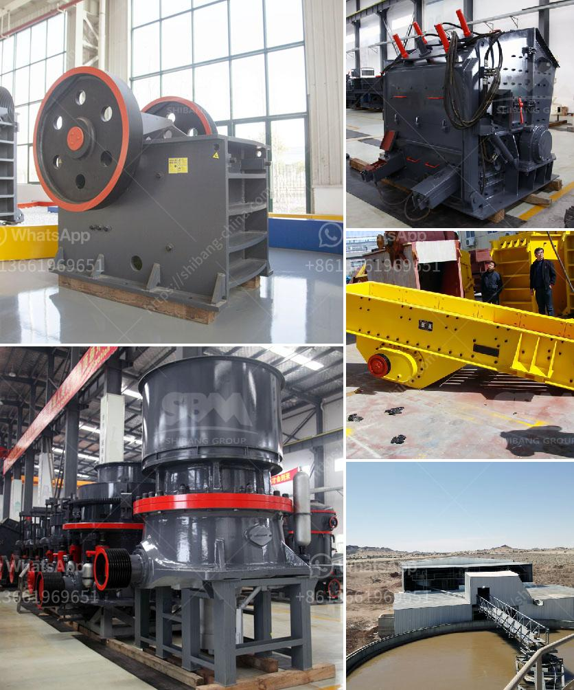

<h3>price conveyor belts in malaysia</h3>
Conveyor belts have become an essential component in various industries, including manufacturing, mining, logistics, and automotive. These belts are used to transport materials and products from one point to another, making the process more efficient and convenient. In Malaysia, the price of conveyor belts is influenced by several factors, including quality, size, and functionality.

Quality is a crucial factor when it comes to conveyor belts. High-quality belts are made from durable materials that can withstand heavy loads, temperature variations, and harsh environments. They are designed to last longer, reducing the need for frequent repairs or replacements. On the other hand, low-quality belts may be cheaper initially, but they tend to wear out quickly, leading to additional expenses in the long run. Therefore, it is advisable to invest in high-quality conveyor belts to ensure reliability and longevity.

Size is another factor that affects the price of conveyor belts in Malaysia. Belts come in various widths and lengths, depending on the specific requirements of each industry. Custom sizes are also available for businesses with unique needs. Generally, wider and longer belts are more expensive due to the increased amount of material required for their production. It is essential for businesses to assess their needs accurately and determine the appropriate belt size to avoid unnecessary expenses.

Functionality is an important consideration when purchasing conveyor belts. Different industries have different requirements, and conveyor belts are designed accordingly. Some belts are equipped with features such as heat resistance, oil resistance, or flame retardant capabilities, making them suitable for specific applications. The inclusion of such features may increase the price of the belts. It is crucial for businesses to select belts that align with their specific operational requirements to optimize productivity and avoid overspending.

The brand of the conveyor belts can also influence their price in Malaysia. Well-known brands often command higher prices due to their reputation for delivering high-quality products. These brands have a track record of meeting industry standards and providing reliable solutions. However, it is essential to consider the needs and budget of the business before opting for a particular brand. Sometimes, lesser-known brands offer similar quality at a more affordable price point, making them a viable option for businesses looking to minimize costs.

In Malaysia, the price of conveyor belts can range from RM10 to RM50 per meter, depending on the factors mentioned above. It is crucial to conduct thorough research and compare prices from different suppliers to ensure the best value for money. Businesses should also consider the after-sales service provided by the supplier, such as warranty and maintenance support, as this can impact the overall cost-effectiveness of the purchase.

In conclusion, the price of conveyor belts in Malaysia is influenced by various factors, including quality, size, functionality, and brand. It is crucial for businesses to carefully evaluate their needs and budget before making a purchasing decision. Investing in high-quality belts that align with specific operational requirements can lead to long-term cost savings. Additionally, comparing prices from different suppliers and considering after-sales service are essential steps to ensure the best value for money.
<h3>Contact us</h3><ul><li><strong>Whatsapp:&nbsp;<a href="https://wa.me/8613661969651">+8613661969651</a></strong></li><li><a href="https://swt.shibang-china.com/?git&amp;zhl&amp;price conveyor belts in malaysia"><strong>Online Service(chat now)</strong></a></li></ul><h3>Related</h3><ul><li><a href='grinding machine for calciun carbinate from germany.md'>grinding machine for calciun carbinate from germany</a></li><li><a href='mobile cone crusher.md'>mobile cone crusher</a></li><li><a href='aggregate washing plant cost.md'>aggregate washing plant cost</a></li><li><a href='used pulverizer ball mill india.md'>used pulverizer ball mill india</a></li><li><a href='how to calcium plant manufacturer.md'>how to calcium plant manufacturer</a></li></ul>