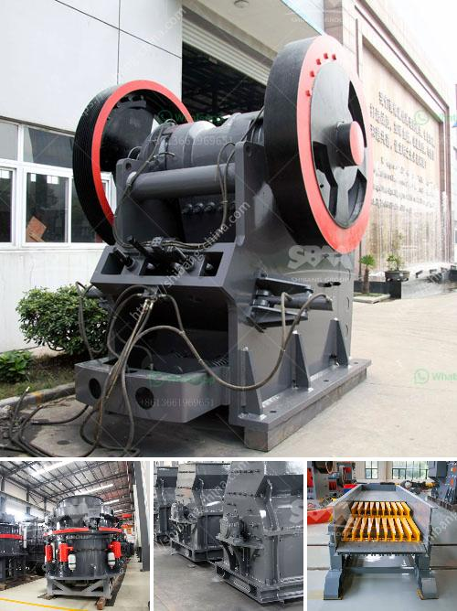

<h3>price copper concentration plant</h3>
The price of copper concentration plants has been a topic of interest for many industries and investors. Copper concentration plants are essential facilities in the mining and metallurgical sectors, responsible for extracting copper from its ores and producing refined copper products. The prices associated with these plants are influenced by several factors, including their capacity, technology, location, and market demand for copper.

One of the primary factors determining the price of a copper concentration plant is its capacity. Plants with higher capacity can process larger quantities of copper ore, resulting in a higher output of refined copper. These larger plants often require more extensive and expensive infrastructure, machinery, and labor, leading to a higher upfront cost and, consequently, a higher price tag. However, such plants also have the advantage of economies of scale, allowing them to produce copper at a lower cost per unit, which can offset the initial investment.

The technology used in copper concentration plants also plays a crucial role in determining their price. Modern and efficient technologies can enhance the recovery rate of copper from the ores, reducing the amount of waste generated and increasing the overall productivity of the plant. However, implementing advanced technologies often requires significant investment in research and development, as well as specialized equipment and machinery, all of which can contribute to a higher price for the plant.

Location is another factor that affects the price of copper concentration plants. Plants located in areas with abundant copper reserves and favorable mining environments tend to have lower costs associated with transportation and logistics. Conversely, plants set up in remote or geographically challenging regions might face higher costs due to the need for infrastructure development, labor availability, and supply chain management. The local regulatory environment and the availability of utilities and natural resources, such as water and power, also impact the overall cost of establishing and operating a copper concentration plant.

Market demand for copper is a vital factor influencing the price of concentration plants. Copper is a widely used metal, with applications in various industries, including construction, electrical and electronics, transportation, and telecommunications. The global demand for copper fluctuates based on factors like economic growth, infrastructure development, and technological advancements. When the demand for copper is high, there is a greater incentive for the mining industry to invest in concentration plants, which can drive prices up. Conversely, during periods of low demand, the prices of copper plants may decline as producers scale back their production capacity.

In conclusion, the price of copper concentration plants depends on multiple factors, including capacity, technology, location, and market demand for copper. Higher capacity plants tend to have higher upfront costs but benefit from economies of scale for more cost-effective production in the long run. Advanced technologies can increase efficiency and productivity but require significant investments. The location of the plant influences transportation and logistic costs, while market demand determines the overall incentive for investment. Understanding these factors is crucial for investors and industries looking to establish or expand copper concentration plants.
<h3>Contact us</h3><ul><li><strong>Whatsapp:&nbsp;<a href="https://wa.me/8613661969651">+8613661969651</a></strong></li><li><a href="https://swt.shibang-china.com/?git&amp;zhl&amp;price copper concentration plant"><strong>Online Service(chat now)</strong></a></li></ul><h3>Related</h3><ul><li><a href='used sand mining equipment sale.md'>used sand mining equipment sale</a></li><li><a href='hand powered rock crusher binq mining.md'>hand powered rock crusher binq mining</a></li><li><a href='sand and gravel mining equipment for sale.md'>sand and gravel mining equipment for sale</a></li><li><a href='small ball mill for alumina.md'>small ball mill for alumina</a></li><li><a href='sand washing machine price.md'>sand washing machine price</a></li></ul>