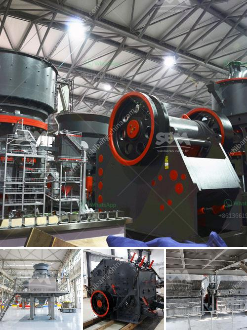

<h3>price list ball mill equipment</h3>
With the development of technology, more and more manufacturers are starting to produce various types of ball mill equipment to meet the market demand. As a leading manufacturer in the industry, Hongxing Machinery keeps introducing advanced technology and equipment to meet the changing market needs. Here, I will introduce the price list of ball mill equipment with a range of 300-500 words.

Generally speaking, the price of ball mill equipment is affected by many factors, such as the type of equipment, the quality of the equipment, the model, the price of raw materials, the geographical location of the manufacturer, and market competition. Therefore, the price of ball mill equipment varies from manufacturer to manufacturer.

Firstly, let's take a look at the types of ball mill equipment. According to different production capacity, ball mills can be divided into small ball mill, medium ball mill, and large ball mill. Hongxing Machinery produces a variety of sizes and specifications of ball mills to meet different production needs.

Secondly, the quality of the equipment also affects the price. High-quality ball mill equipment is usually made of better materials and has more advanced production technology. The cost of these materials and technologies directly determines the price of the equipment. In addition, high-quality equipment often has a longer service life, which can bring greater economic benefits to users in the long run.

The model of the ball mill equipment also affects its price. The more advanced the model, the higher the price. This is because advanced models often have more functions and higher processing capacity. Users need to choose the appropriate model according to their own production needs and budget.

Raw material prices are another important factor affecting the price of ball mill equipment. The prices of different raw materials fluctuate due to factors such as market supply and demand, transportation costs, and government policies. Manufacturers need to adjust their equipment prices accordingly to ensure their own interests.

The geographical location of the manufacturer also affects the price. Manufacturers in different regions may have different production costs, labor costs, and transportation costs. These factors will affect the final price of the equipment. For example, manufacturers in developed regions often have higher prices due to higher labor costs and operating expenses.

Lastly, market competition plays a significant role in determining the price of ball mill equipment. In a highly competitive market, manufacturers will try their best to attract customers with competitive prices. Therefore, customers should compare the prices of different manufacturers and choose the one that offers the best value for money.

In conclusion, the price of ball mill equipment varies depending on various factors such as the type of equipment, the quality, the model, the price of raw materials, the geographical location of the manufacturer, and market competition. Customers should consider these factors and choose the equipment that best meets their production needs and budget. Hongxing Machinery, as a professional manufacturer, provides customers with various types of high-quality ball mill equipment at competitive prices.
<h3>Contact us</h3><ul><li><strong>Whatsapp:&nbsp;<a href="https://wa.me/8613661969651">+8613661969651</a></strong></li><li><a href="https://swt.shibang-china.com/?git&amp;zhl&amp;price list ball mill equipment"><strong>Online Service(chat now)</strong></a></li></ul><h3>Related</h3><ul><li><a href='industrial conveyor belts dimensions.md'>industrial conveyor belts dimensions</a></li><li><a href='small scale gold mining in zimbabwe.md'>small scale gold mining in zimbabwe</a></li><li><a href='medium jaw crusher gold mill for sale.md'>medium jaw crusher gold mill for sale</a></li><li><a href='chinese aggregate crusher suppliers.md'>chinese aggregate crusher suppliers</a></li><li><a href='feed mill manufacturer in davao.md'>feed mill manufacturer in davao</a></li></ul>