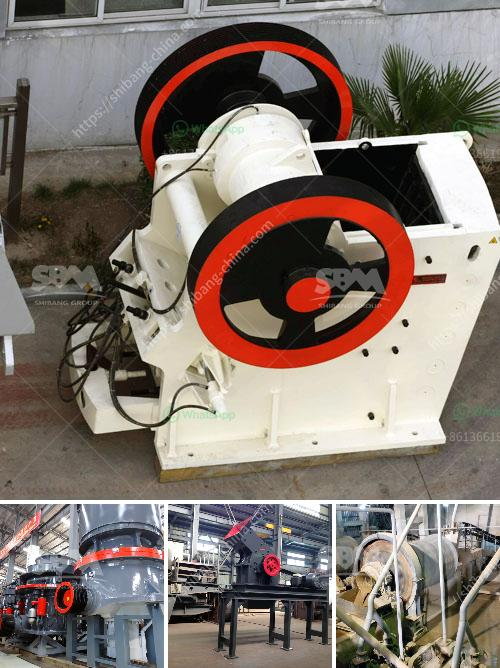

<h3>price list heavy equipment stone crusher</h3>
A stone crusher, also known as rock crusher, is one of the most commonly used mining machines in the mining industry. As a result of its extensive usage in the mining and construction industries, the operating cost for a stone crusher has always been a matter of concern for customers. In fact, many customers are willing to pay a considerable amount to get their desired product. Therefore, it is crucial to know the price list of a stone crusher before making any decision.

Generally, the price of a stone crusher depends on its capacity, processing capacity, production volume, and other factors. Among these factors, the choice of model is crucial. Generally, a stone crusher with a relatively small size has a low price, while a stone crusher with a large size will have a higher price. This is due to the fact that larger stone crushers consume more materials and incur higher costs during the manufacturing process.

On average, the price of a stone crusher can range from $300 to $800,000 depending on the size, type, and capacity. However, it is important to compare prices of different stone crushers before making any purchase to ensure you get the best deal possible. Additionally, it is essential to take into consideration the after-sales service provided by the manufacturer. A reliable and responsive after-sales service can save you a lot of money in the long run.

When it comes to the price list of heavy equipment stone crushers, it is usually divided into two categories: fixed crushers and mobile crushers. Fixed stone crushers are designed for medium to large-scale mining and construction projects whereas mobile crushers are more suitable for smaller projects and temporary construction sites. Both types of crushers have their own advantages and disadvantages.

In terms of pricing, fixed stone crushers generally have higher prices compared to mobile stone crushers. This is because fixed crushers require a more complex infrastructure and have a higher production capacity. On the other hand, mobile stone crushers are relatively cheaper due to their mobility and flexibility. They can be easily transported to different worksites, which reduces the transportation costs.

In conclusion, the price list of heavy equipment stone crushers varies based on the type and capacity of the equipment. As a customer, it is important to identify your needs and budget before making any purchase. Comparing prices and understanding the after-sales service provided by the manufacturer will help you make an informed decision. Regardless of the price, investing in a high-quality stone crusher can greatly increase productivity and efficiency in your mining or construction project.
<h3>Contact us</h3><ul><li><strong>Whatsapp:&nbsp;<a href="https://wa.me/8613661969651">+8613661969651</a></strong></li><li><a href="https://swt.shibang-china.com/?git&amp;zhl&amp;price list heavy equipment stone crusher"><strong>Online Service(chat now)</strong></a></li></ul><h3>Related</h3><ul><li><a href='bauxite mining process.md'>bauxite mining process</a></li><li><a href='metal crusher suppliers in sri lanka.md'>metal crusher suppliers in sri lanka</a></li><li><a href='stone crusher machine rentals in ghana.md'>stone crusher machine rentals in ghana</a></li><li><a href='dicalcium phosphate process hydrochloric acid flow chart.md'>dicalcium phosphate process hydrochloric acid flow chart</a></li><li><a href='all quarries crushing plants.md'>all quarries crushing plants</a></li></ul>