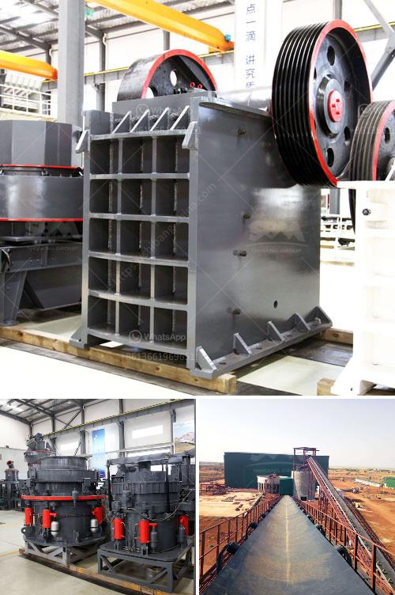

<h3>price of ball mill in india</h3>
India is rich in mineral resources, and the mining industry plays an important role in the country's economy. India has emerged as one of the leading producers of minerals in the world, with a wide range of minerals including coal, iron ore, bauxite, manganese, copper, lead, zinc, limestone, and graphite.

In the mining industry, the ball mill is a vital tool for regrinding the crushed materials. India markets a wide variety of ball mills, which are designed for grinding and mixing diverse types of materials into fine powder. The ball mill suppliers in India supply ball mills to all over the world, especially in India.

How much does a ball mill cost in India? The price of ball mill in India is mainly influenced by the following factors:

1. Type of machine. Ball mills are divided into vertical ball mill and horizontal ball mill. The vertical ball mill has the advantages of a compact design and small footprint, while the horizontal ball mill has the benefits of low investment cost and stable operation.

2. Capacity of machine. The capacity or throughput of a ball mill is directly linked to particle size of the ball mill discharge. For example, it takes approximately 3 times as long to achieve 200 mesh grind as it does to achieve 65 mesh grind. Thus, buildings and equipment used to grind or crush any non-metallic mineral, such as stone, sand, gravel, clay, rock, salt and vermiculite have specific requirements for throughput capacity. Therefore, the higher the capacity of the ball mill, the higher the price.

3. Material quality. The ball mill is made of high-quality materials, and its quality directly affects the overall performance of the equipment. High-quality materials usually have higher prices, but they have a longer service life and better performance, which can effectively reduce the operation and maintenance costs.

4. Manufacturer reputation. The reputation of the manufacturer and their after-sales service also influence the price of the ball mill. Well-known manufacturers often charge a higher price due to their brand reputation and customer satisfaction. However, they also provide better product quality assurance and after-sales service, ensuring a better customer experience.

In summary, the price of a ball mill in India is influenced by several factors including the type, capacity, material quality, and manufacturer reputation. Customers should consider these factors comprehensively and make a reasonable choice based on their specific needs and budget.

It is advisable to compare prices from different suppliers and manufacturers before making a purchase. This will help find the most suitable ball mill at a competitive price. Additionally, customers can also negotiate and discuss the price with the manufacturer or supplier, especially when purchasing in bulk or for long-term projects.

Lastly, it is crucial to consider the long-term benefits and return on investment of the ball mill. A high-quality ball mill, albeit at a higher price, can provide better performance, longer service life, and lower maintenance costs, resulting in overall cost savings in the long run for mining operations.

In conclusion, the price of a ball mill in India varies based on different factors, with a range of options available to cater to different needs. It is essential to carefully evaluate these factors and seek expert advice when purchasing a ball mill to ensure the best value for money and optimal performance in mining operations.
<h3>Contact us</h3><ul><li><strong>Whatsapp:&nbsp;<a href="https://wa.me/8613661969651">+8613661969651</a></strong></li><li><a href="https://swt.shibang-china.com/?git&amp;zhl&amp;price of ball mill in india"><strong>Online Service(chat now)</strong></a></li></ul><h3>Related</h3><ul><li><a href='small stone crusher machine in italy.md'>small stone crusher machine in italy</a></li><li><a href='sand washing plant process.md'>sand washing plant process</a></li><li><a href='china raymond mill company.md'>china raymond mill company</a></li><li><a href='coal powder making.md'>coal powder making</a></li><li><a href='manufacturer of coal processing equipment.md'>manufacturer of coal processing equipment</a></li></ul>