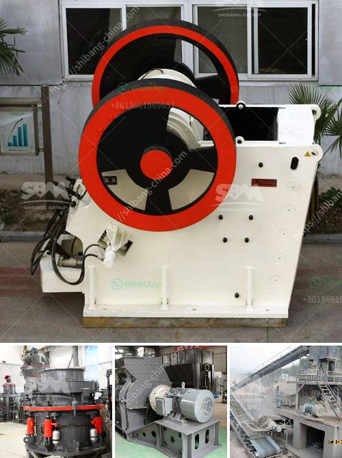

<h3>price of conveyor belts</h3>
Conveyor belts play a vital role in various industries, from manufacturing to mining, in ensuring the smooth and efficient transportation of goods. As such, the price of conveyor belts becomes a crucial consideration for businesses looking to invest in this essential equipment.

The price of conveyor belts varies greatly based on numerous factors, including the size, length, material, and type of conveyor belt required for a specific application. Generally, conveyor belts can range in price from a few hundred dollars to thousands of dollars. 

For smaller businesses or applications that require shorter belts, prices tend to be more economical, starting at around $200 for a basic belt. These lower-priced belts are often made from rubber or PVC materials, which offer decent durability and are suitable for light to moderate usage.

However, for heavy-duty applications or industries that demand higher durability and strength, the prices can be significantly higher. Conveyor belts made from materials like steel cord or rubber compound can cost upwards of $1000. These belts are designed to withstand harsh conditions, heavy loads, and abrasive materials, ensuring a longer lifespan and lower maintenance costs.

Another factor that affects the price of conveyor belts is size and length. Longer belts generally cost more due to the additional material required. The width of the belt also impacts the price, as wider belts require more material, resulting in higher costs.

Furthermore, specialized conveyor belts designed for specific industries or applications, such as food-grade belts or belts with specific inclinations, may come at a premium price. These belts undergo rigorous testing and often require certifications to meet industry standards, resulting in higher manufacturing costs.

It is essential for businesses to carefully assess their needs and budget when considering the price of conveyor belts. While investing in high-quality and durable belts may involve a higher upfront cost, it can lead to long-term savings by reducing maintenance and replacement expenses.

Additionally, it is advisable to compare prices from different suppliers to ensure that the chosen conveyor belt offers the best value for money. Considering factors like warranty, customer reviews, and after-sales support can also help in making an informed decision.

In conclusion, pricing for conveyor belts ranges from a few hundred dollars to several thousand, depending on factors like size, material, and application. Investing in the right belt that meets the specific requirements and offers adequate durability is crucial for businesses to ensure smooth operations and minimize downtimes.
<h3>Contact us</h3><ul><li><strong>Whatsapp:&nbsp;<a href="https://wa.me/8613661969651">+8613661969651</a></strong></li><li><a href="https://swt.shibang-china.com/?git&amp;zhl&amp;price of conveyor belts"><strong>Online Service(chat now)</strong></a></li></ul><h3>Related</h3><ul><li><a href='materials vibrating feeder.md'>materials vibrating feeder</a></li><li><a href='vsi crusher for 100tph output per hour.md'>vsi crusher for 100tph output per hour</a></li><li><a href='flow chart of three stage agreegate crushing plant.md'>flow chart of three stage agreegate crushing plant</a></li><li><a href='china raymond mill company.md'>china raymond mill company</a></li><li><a href='mobile coal crusher price sa.md'>mobile coal crusher price sa</a></li></ul>