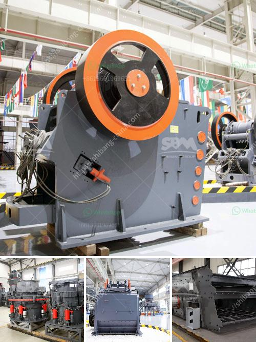

<h3>price of grinder machine in bangladesh</h3>
Bangladesh, being a developing country, requires a wide range of tools and machinery for its various industries. One such essential tool is the grinder machine, which finds applications in the construction, fabrication, and agriculture sectors. However, when it comes to purchasing a grinder machine in Bangladesh, understanding the price range is crucial to make an informed decision. In this article, we will explore the different price ranges of grinder machines available in the market.

In the lower price range, ranging between BDT 3,000 to BDT 10,000, one can find basic grinder machines suitable for small-scale tasks. These machines are compact, lightweight, and ideal for home use or small workshops. Though they may lack advanced features, they can effectively handle tasks like grinding metal, sharpening blades, or polishing surfaces.

Moving up the ladder, the mid-range grinder machines in Bangladesh are priced between BDT 10,000 and BDT 30,000. These machines are more powerful, sturdy, and versatile compared to the lower range options. With higher motor capacities and additional accessories, these machines can efficiently handle heavier tasks, making them suitable for medium-scale industries, such as construction or fabrication workshops.

For those looking for professional-grade equipment, the high-end grinder machines in Bangladesh can cost between BDT 30,000 to BDT 50,000. These machines come equipped with various advanced features, such as adjustable speed settings, larger grinding wheels, and superior build quality. Catering to heavy-duty industrial tasks, these machines provide exceptional performance, durability, and efficiency.

It is important to note that the prices mentioned above are approximate and can vary depending on factors like brand, features, and market demand. Additionally, it is always recommended to thoroughly research and compare different models and brands before purchasing a grinder machine.

Moreover, warranties, after-sales service, and availability of spare parts should also be considered when making a purchase decision. Opting for reputable brands and authorized dealers can ensure quality products and reliable customer support.

In conclusion, the price of grinder machines in Bangladesh varies significantly depending on factors such as the intended use, brand, and features. With options ranging from basic models for domestic use to professional-grade machines for heavy-duty industrial tasks, there is a grinder machine available for every budget and requirement. By carefully considering one's needs and conducting thorough research, buyers can make a well-informed decision and invest in a grinder machine that will meet their expectations and deliver outstanding performance for years to come.
<h3>Contact us</h3><ul><li><strong>Whatsapp:&nbsp;<a href="https://wa.me/8613661969651">+8613661969651</a></strong></li><li><a href="https://swt.shibang-china.com/?git&amp;zhl&amp;price of grinder machine in bangladesh"><strong>Online Service(chat now)</strong></a></li></ul><h3>Related</h3><ul><li><a href='cost of setting up a quarry crusher in nigeria.md'>cost of setting up a quarry crusher in nigeria</a></li><li><a href='manufacturer of ball mill india.md'>manufacturer of ball mill india</a></li><li><a href='price of quarry crusher machines.md'>price of quarry crusher machines</a></li><li><a href='cone crusher uae dealer.md'>cone crusher uae dealer</a></li><li><a href='jaw crusher 24x12 price.md'>jaw crusher 24x12 price</a></li></ul>